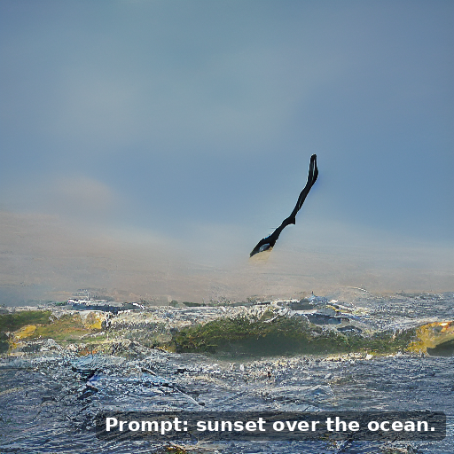

# AquariusDiffusion

**Native low-bit (NLT) diffusion models** — the weights live in the quantized space
`{−s, 0, +s}` from step 0, instead of being compressed after an fp16 pre-training run.

```
AquariusDiffusion/
└── AquariusImage/                        image-diffusion sub-series
    └── AquariusTerimage/                 ternary (3-value) text-to-image  <- released
        ├── README.md / README_zh.md      model page (bilingual, full detail)
        ├── code/ · docs/ · figures/      code, technical report (CN/EN), report figures
        └── portable/ · text_encoder/ · VAE/   where the Release weight files go
```

## Models

| Model | Quantizer | Status |
|---|---|---|
| [**Aquarius Terimage**](AquariusImage/AquariusTerimage/) | ternary `{−s, 0, +s}`, one fp16 scale per 128 weights + STE | **released** — 558,347,012 params in a single 152.99 MB file (2.192 bpw), bit-exact int4 fused-kernel runtime |
| Aquarius Binimage | binary `{−s, +s}` | **not trained** — the compute budget was exhausted (report §7.1). No weights, no samples. |

<p align="center">
  
  <br>A real **512×512** output of the released checkpoint · prompt: `sunset over the ocean.`
  <br><sub>Its strength is exactly this: colour tone and sky/sea layering — recognizable objects are still unreliable (see the honest result below).</sub>
</p>

## Start here

- **Model page — how to run it:** [`AquariusImage/AquariusTerimage/README.md`](AquariusImage/AquariusTerimage/README.md)
- **Weights:** published in this repository's **Releases** (three files). The int4 runtime
  kernel is **rebuilt from the base-3 master at load time, for your device**, so no prebuilt
  CUDA-specific file is shipped.
- **Technical report** (CN/EN, PDF + Markdown): [`docs/`](AquariusImage/AquariusTerimage/docs/)
- **The honest result in one line:** native low-bit training and low-bit fused-kernel
  inference are verified feasible end-to-end on real hardware; at this data scale the
  model's **quality is below a usable release bar**, and the saturation evidence is
  documented rather than glossed over.

## Licence

**Apache License 2.0** — code, documentation **and the model weights**
(see [LICENSE](LICENSE) / [NOTICE](NOTICE)). Bundled third-party components — the
Qwen3.5-0.8B text-encoder base, the SD1.5 VAE, and COCO train2017 training data — keep
their own upstream terms.
