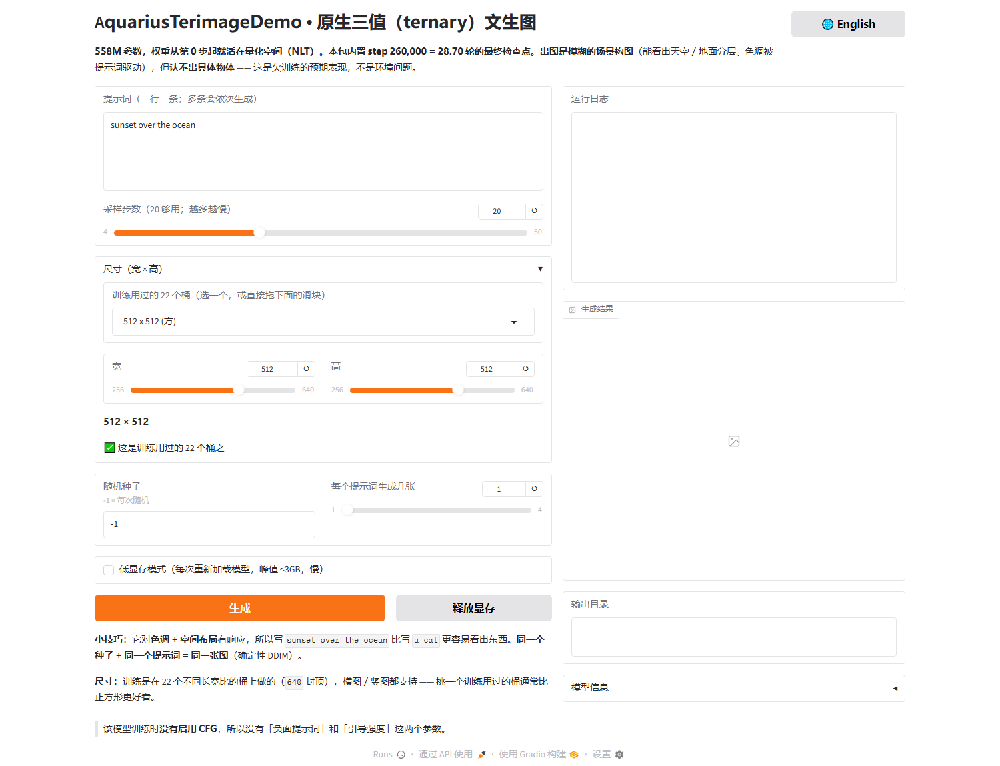

# Aquarius —— 从零开始的原生三值文生图扩散模型

**原生低比特训练（NLT）** · 558,347,012 参数 · **152.99 MB** 单文件模型（2.192 bpw）· 附完整技术报告

[English](README.md) | 中文

**模型名：Aquarius Terimage** —— 属于 **AquariusDiffusion** 系列（原生低比特文生图扩散）。

---

## 这是什么？

几乎所有低比特扩散模型的工作都是「先用 fp16 训好，再压缩」（PTQ / QAT）。
**Aquarius 反其道而行：权重从第 0 步起就活在量化空间里**（原生低比特训练，NLT）。
一个 558M 参数的文生图 UNet 从随机初始化开始训练，其中 **540,147,712 个权重被约束在
三值 `{−s, 0, +s}`**（每 128 个权重共享一个 fp16 scale，g128 mean-scale + STE），
在单卡 32 GB 消费级 GPU 上跑了 260,000 步（≈ COCO train2017 的 28.70 轮）
—— 无塌缩、无发散、无 OOM。

两条结论，都摆在明面上：

1. **可行性：成立。** NLT 训练端到端稳定；三值权重可以**比特级无损**地映射进
   torch 自带的 `_weight_int4pack_mm` int4 算子（`q₄ = q·7 + 8 ∈ {1, 8, 15}`），
   推理时权重常驻仅 **287.3 MB**，解包融合在 GEMM 内部完成。
2. **模型质量：不达标。** 这是有意保留的负面结果。clip_ratio 的全部涨幅发生在
   step 9k–110k；**随后 13 万步净变化 ≈ 0**，全程峰值 0.3782 出现在 step 170k。
   基于这一饱和证据、加上租用算力经费耗尽，训练在 step 260,000 主动停止。

> ### ⚠️ 预期出图效果 —— 务必先读
> 生成结果是**模糊的场景构图，认不出具体物体**。天空/地面分层、色调与大致空间布局
> 确实受提示词控制（"sunset over the ocean" 远好于 "a cat"）。**这是这个欠训练
> 检查点的预期表现，不是环境问题，也不是脚本有 bug。**
> 同 seed + 同提示词 = 同一张图（确定性 DDIM，cosine 调度，η = 0）。

## 关键数字

| 项目 | 数值 |
|---|---|
| 参数量 | 558,347,012（其中 540,147,712 个三值量化；其余保持 fp16） |
| 量化器 | 三值 `{−s, 0, +s}`，每 128 权重一个 fp16 scale（g128 mean-scale）+ STE |
| 训练 | 260,000 步 = 28.70 轮，COCO train2017（11.8 万条 caption，22 个长宽比桶），单卡 32 GB |
| 交付件 | **152.99 MB** 单文件，**2.192 bpw** —— base-3 打包，贴近 `log₂3 ≈ 1.585` bit 信息下限 |
| 相对 fp16 | **7.3×** 缩小（fp16 权重 = 1116.73 MB） |
| 推理权重 | int4 融合内核，**比特级无损**，常驻 **287.3 MB** |
| 速度（RTX 5090，512×512，20 步） | 1.34–1.44 s/图（三模型常驻，峰值 **1.92 GB**）· `--te-mode cache` 时 2.27–2.51 s/图（峰值 1.34 GB） |
| 硬件适配 | 8 GB 显卡即可舒适运行 |
| clip_ratio | 9k → 110k 上涨，峰值 **0.3782** @ step 170k，此后走平 |

<p>
  
  
</p>

<p>
  
  
</p>

模型进化对照条（16 个阶段，固定 10 条 caption 协议，较早协议 —— 仅在同协议内可比）：

<p></p>

100 条随机 caption @ 640×640 出图网格：[figures/samples_100captions_web.png](figures/samples_100captions_web.png)

## 仓库结构

```
AquariusImage/
├── code/                  全部源代码（推理 + 训练 + 打包 + 评测）
├── text_encoder/          int8 文本编码器的 tokenizer 与配置伴生文件
│                          （model_int8.safetensors 本体从 Releases 下载）
├── diffusion_model/       （空 —— 把 int4 运行时模型放进来）
├── portable/              （空 —— 把 base-3 母版模型放进来）
├── VAE/                   （空 —— 把 SD1.5 VAE 放进来）
├── docs/                  技术报告（中/英，PDF + Markdown 源）+ stages.json
├── figures/               报告配图（中/英）、界面截图、100-caption 网格
├── requirements.txt
├── LICENSE · NOTICE        Apache-2.0 许可 + 第三方组件声明
└── README.md
```

`text_encoder/` 伴生文件 + 三个空权重文件夹刻意保持与可运行演示包相同的布局：
从 **Releases** 下载四个权重文件放进对应文件夹后，开箱即用。

## 快速开始

```bash
# 1) 先装 CUDA 版 torch（不要让 pip 自选，否则会装成 CPU 版，融合内核不可用）
pip install torch==2.7.1 --index-url https://download.pytorch.org/whl/cu128

# 2) 其余依赖
pip install -r requirements.txt
```

从 **Releases** 下载四个权重文件（见下表）放入对应目录，然后：

| Windows | macOS / Linux |
|---|---|
| 双击 `code/run_ui.bat` | `cd code && python app.py` |

```bash
python app.py --port 8888          # 自定义端口
python app.py --lowvram            # 峰值 < 3 GB，每次重新加载模型（慢）
python app.py --self-test          # 无 UI：在 CPU 上验证全链路
python aq_play.py "a cat on a chair" --res 512 --steps 20   # 命令行，无需 UI
```

默认运行时模型是 **int4 融合内核版 → 仅限 NVIDIA CUDA**
（三值→int4 映射实现在 torch 的 `_weight_int4pack_mm` 上）。
非 CUDA 机器请改用 base-3 母版
（`python app.py --ckpt portable/aquarius_ternary_step260000_base3.safetensors`），
它会反量化到 fp32，慢一些但跨平台。

文本编码器权重以 int8 形态存储、在量化空间内重建 —— `transformers.from_pretrained`
读不了这个文件，所以才有 `code/load_te.py`（已接进 `app.py` / `aq_play.py`，无需额外操作）。

### 权重下载（GitHub Releases，单文件均 ≤ 2 GB）

| Release 资产 | 体积 | 放到 |
|---|---|---|
| `aquarius_ternary_step260000_base3.safetensors` | 152.99 MB | `portable/` |
| `diffusion_model_step260000.safetensors`（int4 CUDA 运行时） | 323.48 MB | `diffusion_model/` |
| `model_int8.safetensors`（文本编码器，Qwen3.5-0.8B 语言塔，int8） | 755.56 MB | `text_encoder/` |
| `VAE.safetensors`（SD1.5 VAE，fp16） | 334.64 MB | `VAE/` |

> **镜像**：同一组权重文件也会发布在 **Hugging Face**；HF 模型卡链接上传完成后更新在这里。
> 本 README 始终是下载链接的权威出处。

> 不要把 base-3 母版丢进 `diffusion_model/` —— 该目录按「最高步数」glob 选模型，
> 同步数会造成歧义。请用 `--ckpt` 显式指定。

## 代码地图

| 文件 | 职责 |
|---|---|
| `code/aq_unet.py` | 558M UNet + NLT 量化器（g128 mean-scale，STE） |
| `code/aq_kernel.py` | 低比特融合 GEMM 路径（三值 → int4 `_weight_int4pack_mm`） |
| `code/aq_lowbit.py` | base-3 比特级无损打包/解包 |
| `code/load_te.py` | int8 文本编码器独立加载器 |
| `code/aq_play.py` | 推理引擎 + 命令行（全部调参开关都在这里） |
| `code/app.py` | Gradio 网页 UI（中英双语） |
| `code/run_ui.bat` | Windows 启动器（刻意 ASCII + CRLF，原因见文件内注释） |
| `code/aq_train.py` | NLT 训练循环（权重从 step 0 起量化） |
| `code/aq_pack.py` / `aq_pack_int4.py` | 检查点 → base-3 交付件 / → int4 运行时文件 |
| `code/aq_clip_score.py` | CLIP 图文对齐分数，以真实 COCO 上界归一化 |
| `code/aq_metrics.py` | 统计健康度指标（对噪声地板 / 自检基准归一） |
| `code/aq_te_slim.py` / `aq_slim_ckpt.py` / `_te_slim_loader.py` / `aq_export_latest.py` | TE int8 精简、检查点精简、导出工具 |
| `code/aq_paths.py` / `aq_units.py` | 跨机器路径解析器（不写死用户目录）/ 十进制 MB-GB 单位换算 |
| `code/aq_turbo.py` | **路线图脚手架**：DMD2 式一步蒸馏（G = 三值权重，STE 保持开启）—— 尚未训练 |
| `code/aq_sample.py` | 进化对照条所用分阶段采样器 |

训练侧脚本（`aq_train.py`、`aq_sample.py`、`aq_turbo.py`、`aq_pack.py`）假定原训练
工作区布局（通过 `aq_paths.py` 与 `aq_train.py` 顶部的常量解析），在单卡 32 GB 上验证过。
推理/演示文件自包含、可移植。

## 文档

- [docs/Aquarius_Technical_Report_CN.pdf](docs/Aquarius_Technical_Report_CN.pdf) · [.md](docs/Aquarius_Technical_Report_CN.md)
- [docs/Aquarius_Technical_Report_EN.pdf](docs/Aquarius_Technical_Report_EN.pdf) · [.md](docs/Aquarius_Technical_Report_EN.md)
  - 若只读一节：**§5.6「六条可迁移的实测结论」**。
- [docs/stages.json](docs/stages.json) —— 进化对照条的阶段登记表
- [RELEASE.md](RELEASE.md) —— 维护者说明：四个权重文件如何发布

## 许可

- **本仓库代码与文档：Apache License 2.0**（见 [LICENSE](LICENSE) 与 [NOTICE](NOTICE)）。
- **权重**仅用于研究复现。注意其组成：文本编码器基于 **Qwen3.5-0.8B**，VAE 与
  UNet 结构同构于 **SD1.5**，训练数据为 **COCO train2017** —— 各依其原许可，
  二次分发前请自行核对。

## 引用

```bibtex
@techreport{du2026aquarius,
  title       = {Aquarius: A From-Scratch Natively Ternary Text-to-Image Diffusion Model},
  author      = {Du, Junyi},
  institution = {Independent Research},
  year        = {2026},
  month       = {10},
  note        = {Technical report, code and weights}
}
```

## 致谢

- **AI 辅助**：代码实现、数据分析与报告撰写与 **GLM-5.3-Flash**（智谱 Z.ai）及 **DeepSeek V4.1 Flash**（DeepSeek AI）协作完成 —— 详见报告致谢章节。
- **TerDiT**（ICLR 2025）—— 首个从零三值扩散训练，路线在 DiT 规模上已获验证。
- **Bonsai Image**（PrismML）—— 低比特打包与发布规范的参考。
- **SD1.5**（Stability AI）—— VAE 权重与 UNet 结构参照 · **Qwen3.5**（阿里）—— 文本编码器基座 · **COCO** —— 训练数据。
