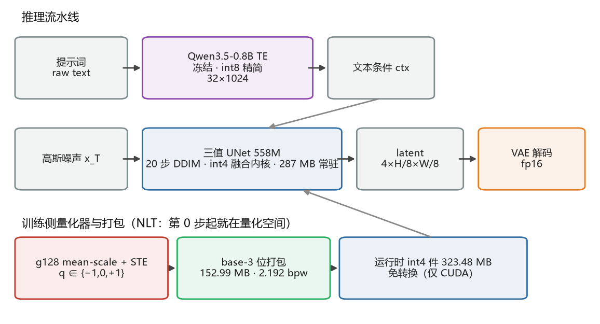
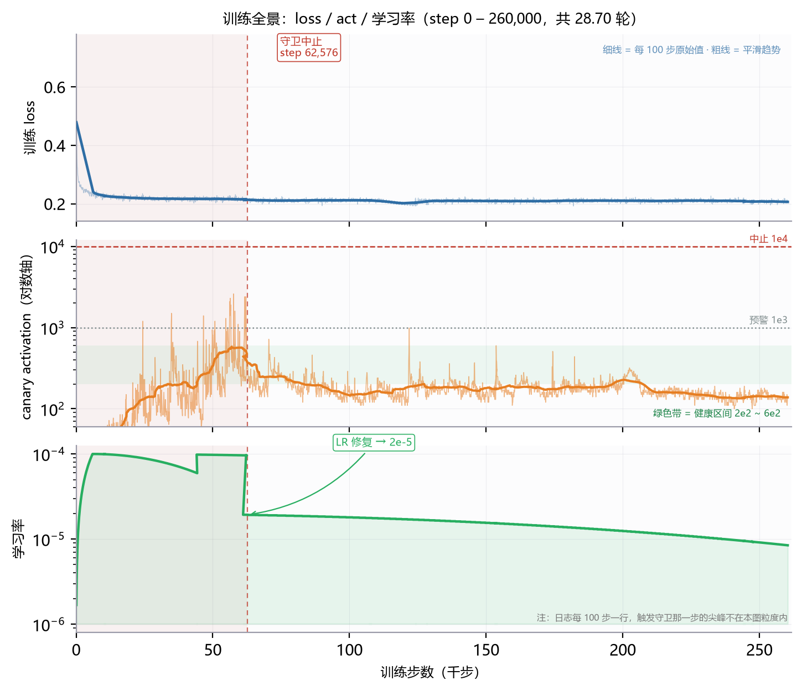
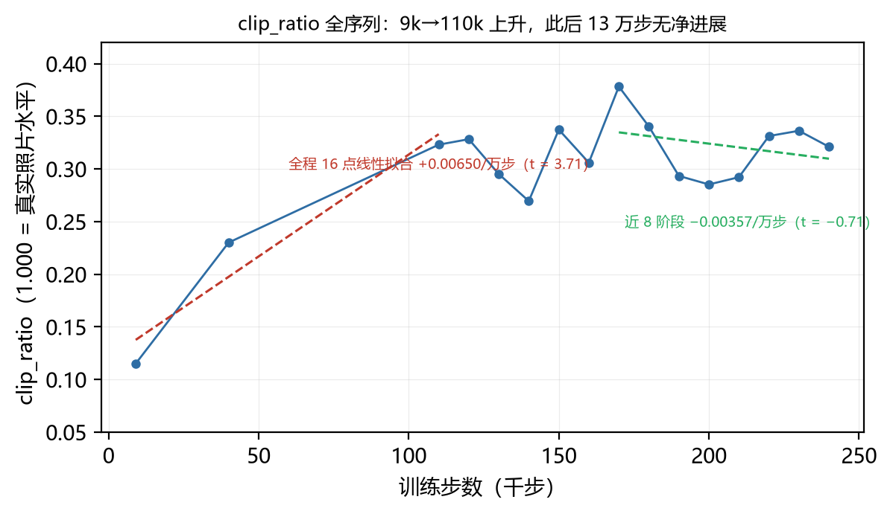
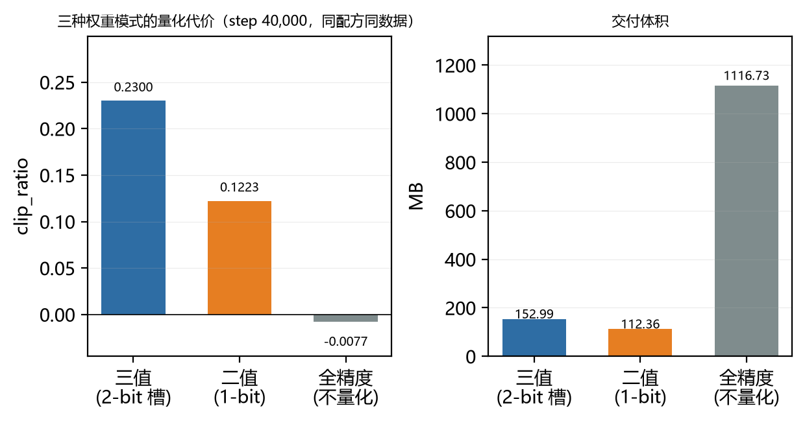
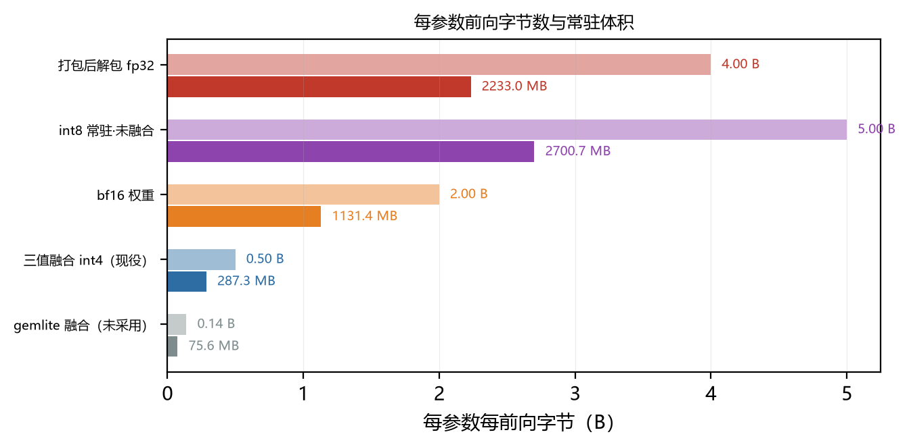
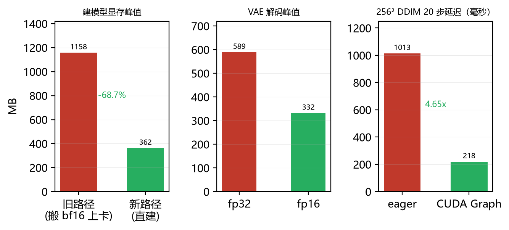
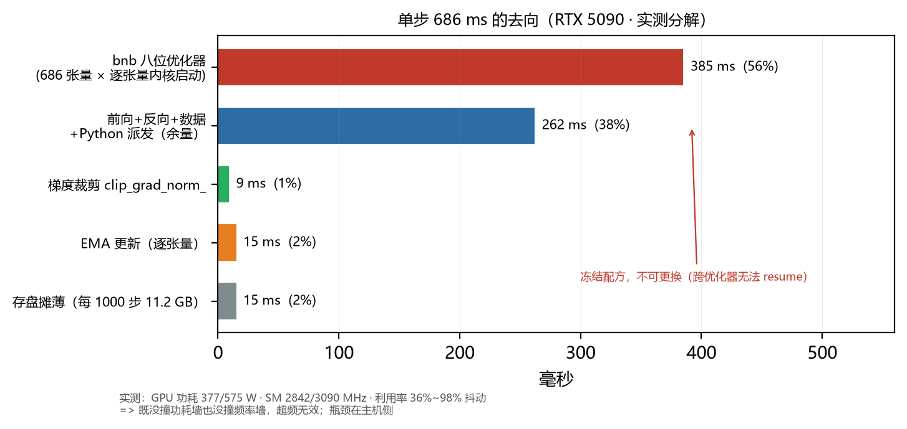

# Aquarius：从零训练的原生三值文生图扩散模型

### 训练可行性、融合内核推理与饱和分析

**技术报告 · 两栏版式（US Letter · Times 10 pt · IEEE 编号引用）**

作者：Junyi Du（独立研究）
机构：独立研究者
日期：2026-10-04
代码与模型：见 §9 复现入口
AI 辅助：GLM-5.3-Flash 与 DeepSeek V4.1 Flash（详见文末致谢）

> **版本说明**：本报告对应**最终检查点 step 260,000 = 28.70 轮**。全文数字均为**实测值或由实测值直接导出**，
> 无待填占位符。训练在 260,000 步主动停止的依据见 §7.1。

## 摘要

低比特扩散模型的既有工作几乎都是「先在 fp16 预训练、再量化压缩」。本文提出的
**Aquarius** 走的是另一条路：**从第 0 步起权重就活在量化空间中**（Native Low-bit
Training, NLT）。我们从头训练了一个 **558,347,012** 参数的文生图 UNet，量化部分
共 **540,147,712** 个参数被约束为三值 `{−s, 0, +s}`，每 **128** 个权重共享一个 fp16
尺度（g128 mean-scale + STE）。训练在单张 32 GB 消费级显卡上稳定推进
260,000 步（≈ 28.70 遍 COCO train2017），全程无塌缩、无发散、
无显存溢出；唯一一次严重事件是学习率被检查点静默覆盖导致的激活失控，已定位并修复。

在**交付形态**上，我们把三值码位按 `log₂3 ≈ 1.585 bit` 的信息下限做 base-3 位打包，
得到 **152.99 MB（2.192 bpw）** 的单文件模型，相对 fp16 权重（1116.73 MB）缩小
**7.3×**。在**推理端**，我们给出了三值到 torch 内置 `_weight_int4pack_mm` 的
**逐位精确**映射（`q₄ = q·7 + 8 ∈ {1, 8, 15}`），使权重以 **287.3 MB** 常驻、解包发生在 GEMM
内部。**本文的结论是双重的**：NLT 训练与低比特融合算子推理**都已在真实硬件上
端到端验证可行**；但在当前数据规模下，模型质量**未达到可用发布水平**，且
clip_ratio 在近 13 万步内无净进展，表明**继续堆步数的边际收益已接近零**。
**基于这一饱和证据、叠加租用算力经费不足，训练在 step 260,000（= 28.70 轮）处主动停止，
而非跑到计划步数（§7.1）。**

**关键词**：原生低比特训练；三值量化；文生图；融合内核；量化感知训练


## 1. 引言

扩散模型的推理成本主要由两部分构成：**权重内存带宽**与**去噪步数**。业界主流做法是
先在 fp16/bf16 上把模型训到收敛，再用训练后量化（PTQ）或量化感知微调（QAT）压低
比特宽度。这种做法有一个结构性隐患：**量化误差是在一个已经收敛到浮点解的空间里
被强行引入的**，模型没有机会在训练过程中适应它。

我们反过来问一个问题：**如果从随机初始化的那一刻起，权重就只能取 `{−s, 0, +s}`
三个值，模型能学到什么？** 这条路线（我们称之为 NLT）在理论上更"干净"——没有
浮点解与量化解之间的分布错配——但工程上风险更高：梯度的量化误差从第 0 步就参与
优化，一旦量化器设计不当，模型可能直接塌缩。

本文的工作可以概括为三个问题、三个答案：

1. **原生低比特训练能不能跑？** 能。我们从头训练到 260,000 步
   （≈ 28.70 遍 COCO），损失稳定在 0.205~0.215，健康守卫全程未触发
   （§5.1，图 2）。
2. **低比特融合算子推理能不能跑？** 能。我们用 torch 内置算子把三值**逐位精确**地
   塞进 int4，权重以 287.3 MB 常驻显存，解包融合在 GEMM 内部完成（§3.5、§5.4）。
   交付件 **152.99 MB**，在真实 GPU 上端到端出图；三模型全常驻峰值显存 **1.92 GB**、单张 **1.34~1.44 s**（§5.7）。
3. **训出来的模型能不能用？** **不能。** 这是本文最重要的负面结论。clip_ratio 的
   上涨全部发生在 step 9k → 110k，其后 13 万步（占已跑量约一半）**净变化 ≈ 0**，
   全程峰值 0.3782 出现在 step 170k（§5.2，图 3）。**在 5.6 亿参数规模上，
   继续在同数据同配方下堆步数已经不再有效。**

本文的贡献：

- 一个**完整可复现**的原生三值文生图训练管线，含量化器、打包格式、训练脚本与
  全部踩坑记录；
- 三值与 int4 **逐位精确**的映射方案，以及从打包文件**直接构建**融合内核模型的
  路径（建模型显存峰值 1158 → 362 MB，**−68.7%**）；
- 一份诚实的**饱和分析**：用 16 个阶段的 clip_ratio 序列证明该规模下的收益拐点；
- 一份**跨平台部署现实性评估**（§6）：现有低比特融合算子只注册了 CUDA，其他设备
  只能退回浮点计算。


## 2. 相关工作

**扩散模型量化。** 训练后量化（PTQ）与量化感知训练（QAT）已在 SD 系模型上被广泛
研究，主流结论是权重可压到 4~8 bit 而质量损失可控。但这些工作都建立在**已收敛的
浮点教师**之上。NLT 的出发点不同：它不接受浮点解作为起点。

**低比特推理内核。** torchao 提供的 `Int4WeightOnly` / `Int8WeightOnly` 路径底层是
`_weight_int4pack_mm` 与 `_weight_int8pack_mm`；gemlite 提供了基于 Triton 的
低位宽 GEMM（支持 `W_nbits ∈ {1,2,4,8}`）。**注意：这两个体系都没有原生三值
（3 状态）内核**——三值必须落进 2-bit 或 4-bit 槽位。

**同期对照：Bonsai Image 4B。** 我们拆解了一个同期发布的低比特文生图模型
（FLUX.2 Klein 4B 的三值/二值版，`gemlite-int2-ternary-g128`）作为对照。它的三层
显存策略——管线级卸载、常驻低比特 + 每组 FP16 尺度、megakernel 治理派发开销——
与我们的设计**同构**（前两层我们都做了，第三层我们用 CUDA Graph 达成）。
其公布的三值 `log₂3 + 16/128 = 1.71 bpw` 与我们的口径**完全一致**，这是对我们
格式选择的独立佐证。**关键差异**：它**同时发布两份**产物——1.21 GB 的平台无关
正本 + 1.54 GB 的预转码部署包；我们选择只发小的一份（§6 讨论这一取舍）。


## 3. 方法

### 3.1 总览



**图 1**：Aquarius 的推理流水线与训练侧量化/打包路径。文本编码器与 VAE 全程冻结，
只有 UNet 参与训练；交付件只含 UNet。

### 3.2 原生低比特训练与量化器

训练与前向使用同一个量化函数（记作 `nlt_quantize`）：

```
s   = mean(|w|)                         # 每 128 个权重一组，clamp_min 1e-8
q   = round(clamp(w / s, -1, 1))        # 三值：q ∈ {−1, 0, +1}
w_q = q · s
```

反向传播用**直通估计器（STE）**：`w + (w_q − w).detach()`。于是前向看到的是量化值，
反向拿到的梯度等价于对 `w` 求导。**有效存储量**为

```
log₂3 / 1参数 + 16 bit / 128参数 = 1.585 + 0.125 = 1.710 bpw
```

这是该参数化下**不可再低**的信息下限（在 fp16 尺度、group=128 的约定下）。

### 3.3 架构与采样

论文正文中我们只陈述与复现相关的结构事实：UNet 采用 SD1.5 同构结构
（`base=256`、`block_out_channels=[256,512,1024,1024]`、`cross_attention_dim=1024`、
8 个注意力头），文本条件来自一个冻结的 Qwen3.5-0.8B 编码器（32 token × 1024 维）。
采样使用**确定性 DDIM（η = 0）+ 余弦噪声调度**，与训练期一致；**训练时未启用 CFG**，
因此推理端没有负向提示词与引导强度这两个自由度。

### 3.4 base-3 位打包

三值只有 3 个状态，**理论下限是 log₂3 = 1.585 bit**；按 2 bit/权重存储比信息下限
多花约 26% 的存储（2 / 1.585 ≈ 1.26）。由于 `3⁵ = 243 ≤ 256`，可以把 **5 个三值码无损塞进 1 个字节**。
我们把训练后的 `(码位, 分组尺度)` 原样搬运（**绝不重新量化**，见 §3.6）后
按 base-3 打包，得到 **152.99 MB / 2.192 bpw** 的交付件。

### 3.5 融合 int4 推理内核

torch 的 int4 权重约定是「半字节值 `0..15` 代表 `−8..7`」，即反量化为
`(q₄ − 8) · scale`。我们**自选** `scale = s/7`、`zero = 0`，反量化随之退化为
`(q₄ − 8) · s/7`。令 `q₄ = q·7 + 8`，则 `q ∈ {−1, 0, +1}` 被映射到
`q₄ ∈ {1, 8, 15}`，且 `(q₄ − 8) · s/7 = q·s` **逐位精确**。于是三值可以无损地
落进 int4 槽位，直接调用 `torch._weight_int4pack_mm`：

| 环节 | 做法 |
|---|---|
| 量化参数 | 自选 `scale = s/7, zero = 0`（自动推导会得到 4~5% 误差） |
| 编码 | `q₄ = q·7 + 8`（**跳过 bf16 中间态**，直接由码位算出 int4 码） |
| 卷积 | `unfold` + 一次 GEMM；K 不足 128 倍数时补 `code=0`（贡献恰为 0） |
| 常驻 | **287.3 MB**（vs bf16 权重 1131.4 MB） |

此外我们实现了**从打包文件直接构建**融合内核模型：在 `torch.device("meta")` 上建空壳、
只灌非量化层、逐层把码位搬上卡并就地打包，从而**完全跳过「把 bf16 UNet 搬上卡」
这一步**（§5.4）。

### 3.6 一个必须避免的静默错误

绝不能从「解包后的浮点权重」反推码位：`w_q = q·s` 再量化会得到
`s′ = mean(|q|)·s ≈ 0.71·s`（实测 `mean(|q|) ≈ 0.71`），整组权重被缩小到 71%，
**而且不报任何错**。我们实测过这一路径：整模型出图 L1 从 ~0 冲到 **37.8/255**。
正确做法是**只从打包文件读 `(码位, 尺度)`**。


## 4. 实验设置

### 4.1 数据

COCO train2017，**118,287** 张。VAE latent 与文本 embedding 均为**预计算**；训练使用
**22 个长宽比桶**（边长 256~640，均为 64 的倍数——这是结构约束，不可调）。

### 4.2 训练配方

| 项 | 值 |
|---|---|
| 优化器 | bitsandbytes 8-bit 分页 AdamW |
| 峰值学习率 | `2e-5`，warmup `6,000` 步，cosine 衰减到 5% 地板 |
| 有效批 | 按 token-pixel 目标 `64,000` 动态分桶（bs 10~17） |
| 精度 | 权重三值；EMA 影子 fp32，衰减 0.999 |
| 硬件 | 单卡 32 GB 消费级 GPU |

> ⚠️ **跨机器复现的关键约束**：`--lr / --warmup / --total-steps` 三个参数**必须逐字一致**，
> 因为它们共同决定 LR 曲线（`lr_at()` 的分母是 `total_steps`）。跨机器只允许改
> `--tokpx-target / --grad-ckpt / --ema-device / --opt` 这四项"显存取舍"。

### 4.3 指标

- **clip_ratio**：`(生成图↔文本 − 错配基线) ÷ (真实图↔文本 − 错配基线)`，1.000 = 达到
  真实照片的 caption 贴合水平。**该指标上界为 1.000，且它本身高估可用性**——纹理与
  色块也能得分。
- **跨图 L1**：度量是否塌缩。仅具**下限**意义。
- **人眼判读**：最终裁决。


## 5. 结果

### 5.1 训练稳定性



**图 2**：训练全景。loss 稳定在 0.205~0.215；`act`（canary activation）全程落在健康
区间 2×10²~6×10²；学习率按 cosine 平滑退火。

**唯一一次严重事件**：step 62,576 起连续三次 `act > 10⁴`，健康守卫判定中止。
根因不是损失发散，而是**把 `total_steps` 重新钉定导致学习率从 5.95×10⁻⁵ 跳回
9.83×10⁻⁵**，对已退火的模型构成一次过激的 warm restart；代价滞后约 18,000 步才显现。
处置：回退一个快照、把峰值学习率降到 2×10⁻⁵、并修复「`--lr` 在恢复训练时被检查点
中的 `base_lrs` 静默覆盖」这一隐藏缺陷。**该次事件之后 19 万步未再复发。**

> **教训**：`total_steps` 是 LR 曲线的一部分，不是"进度上限"。把它当作可随意调整的
> 数字是本项目最昂贵的一次错误。

### 5.2 质量



**图 3**：clip_ratio 全序列（16 个阶段）。

| 区间 | 斜率 | t 值 | 判读 |
|---|---|---|---|
| 全程（16 点） | **+0.00650 / 万步** | 3.71 | 显著上升 |
| 近 8 阶段（170k→240k） | **−0.00357 / 万步** | −0.71 | **无进展** |

上涨**全部发生在 step 9k → 110k** 那一段。此后 13 万步（约占已跑量一半）
**净变化 ≈ 0**；峰值 0.3782 出现在 step 170k，之后在 0.29~0.34 之间震荡。


**图 4**：交付包在本机 GPU 上的真实出图（512×512，20 步 DDIM，不夹潜向量）。

⚠️ **一处必须修正的旧判读**：我们早期在 `640×640 + 潜向量 clamp(−1,1)` 的采样协议下
得出「没有任何一张能认出主体」。但该 clamp 会在 **±1.2σ** 处截断，
**系统性削掉约 26% 的数值**、把输出方差压到 **0.61 倍**。改用不夹潜向量的正确协议后，
**部分提示词已经能认出主体**：`a large lengthy giraffe standing in a field.` 生成了
**有明显可辨的长颈鹿形体、斑点花纹与腿，并配以灌木和天空**；
`an image of a kitchen setting with white wooden shelving` 可读作室内场景。

因此修正后的判读是：**「达不到可用发布水平」的结论不变**（4 条 caption 里只有 1 条
真正认出了主体，且样本量仅 4 张 × 1 个种子），但 **「结构性学习已经发生」是确凿的**。


**图 5**：阶段对照条（固定 10 条 COCO caption，640×640，seed 100000+i）。
**注：该条为较早协议（含潜向量 clamp），仅用于阶段间相对比较。**

### 5.3 量化代价



**图 6**：三种权重模式在 step 40,000 的同配方对照。

| 模式 | clip_ratio @40k | 交付体积 |
|---|---|---|
| **三值（本文）** | **0.2300** | 152.99 MB |
| 二值 | 0.1223 | 112.36 MB |
| 全精度（不量化） | −0.0077 | 1116.73 MB |

**关键观察**：在同一训练预算下，**三值反而比全精度参照更好**。这说明在该规模
（558M 参数）与数据规模下，**三值量化不是瓶颈**——瓶颈在别处（见 §7）。

### 5.4 效率：带宽、显存与延迟



**图 7**：每参数每前向字节数与常驻体积。

| 方案 | 每参数每前向字节 | 常驻体积 |
|---|---|---|
| gemlite 融合（未采用） | 0.14 B | 75.6 MB |
| **三值融合 int4（现役）** | **0.50 B** | **287.3 MB** |
| bf16 权重 | 2.00 B | 1131.4 MB |
| 打包后解包 fp32 | 4.00 B | 2233.0 MB |
| int8 常驻·未融合 | 5.00 B | 2700.7 MB |

> **注意 `int8 常驻·未融合` 每参数要读 5 B —— 比 bf16 还差。** 只有把解得出的权重
> 直接送进乘法器内部，才真正省带宽。



**图 8**：三项显存/延迟优化。从打包文件直接构建使建模型峰值 **1158 → 362 MB
（−68.7%）**，耗时 9.0 → 3.3 s，且与旧路径**输出逐像素相同（L1 = 0.0000）**；
VAE 解码改 fp16 使峰值 589 → 332 MB；把整条 20 步 DDIM 捕获为一张 CUDA Graph 使
256² 单图延迟 **1013 → 218 ms（4.65×）**，且**回放与 eager 逐位一致（最大差 = 0）**。

**端到端交付件实测**：`diffusion_model_step260000.safetensors` = **323.48 MB**
（运行时 int4 布局，载入**零转换**），512×512 / 20 步 DDIM。三模型全常驻（默认 `resident`）下单张 **1.34~1.44 s**、
**进程峰值显存 1.92 GB**（`cache` 模式 2.27~2.51 s / 1.34 GB，见 §5.7），日志确认 `int4 fused kernel (direct build) - 160L + 96C -
skipped 0 - never pushed bf16 onto the card`。

### 5.5 单步耗时分解：瓶颈在主机侧，不在 GPU



**图 9**：一次训练步的实测去向（均值 0.6545 s/步，图中 686 ms 为单步快照）。

| 项 | 耗时 | 占比 |
|---|---|---|
| **bnb 八位优化器**（686 张量 × 逐张量内核启动） | **385 ms** | **56%** |
| 前向 + 反向 + 数据 + Python 派发（余量） | 262 ms | 38% |
| EMA 更新（逐张量循环） | 15 ms | 2% |
| 存盘摊薄（每 1000 步写 11.2 GB） | 15 ms | 2% |
| 梯度裁剪 `clip_grad_norm_` | 9 ms | 1% |

**为什么这很重要**：GPU 侧的优化已经没有空间 —— 实测功耗 **377 W / 上限 575 W**、
SM 时钟 **2842 / 上限 3090 MHz**、利用率在 **36%~98% 之间抖动**，
**既没有撞功耗墙也没有撞频率墙**。时间花在**主机侧 686 次逐张量的内核启动**上，
这是 Windows/WDDM 的固有开销（同规模在 Linux 上约 40 ms）。

> **一个反直觉的实测**：把机器上另一个吃满 9.6 个 CPU 核的进程杀掉后，步时**没有变快**
> （它在跑的窗口 0.6545 s/步，它没跑的窗口 0.7063 s/步）。原因是训练进程本身只用 ~0.9 个核，
> 而机器有 12 个核 —— **CPU 抢占不是瓶颈**。这一点值得记录，因为它推翻了「清干净后台就能提速」的直觉。

**唯一能动的**是把逐张量循环改成 `torch._foreach_*`（EMA 15 → 3 ms、裁剪本已是批量），
合计约 21 ms（3%），但**需要重启训练进程**（代价 ~2 min ≈ 175 步），净收益接近零，故未执行。

### 5.6 六条可迁移的实测结论（本文复用价值最高的部分）

本节把散落在各处的结论集中成 6 条**对他人可直接复用**的实测发现。它们与具体数据集、
具体模型无关，换一个低比特扩散模型项目仍然成立（或至少应当被优先验证）。
**即使读者对文生图本身不感兴趣，这 6 条也仍然可用。**

| # | 结论 | 证据 | 反直觉之处 |
|---|---|---|---|
| 1 | **三值不是质量瓶颈** | step 40k：三值 clip_ratio **0.2300** 优于全精度 **−0.0077** | 直觉认为量化必然掉质量，这里反而更好 |
| 2 | **"低位宽但不融合"是负收益** | int8 常驻·未融合读 **5 B/参数**，**比 bf16 的 2 B 还差** | "int8 比 bf16 省一半带宽"在未融合时完全错误 |
| 3 | **cos 不是量化可行性的判据** | 沿**真实误差方向**扰到 cos **0.609** 出图仍正常；**随机方向**在 cos **0.996** 就塌成纯红色块 | 用 cos 设阈值会得出错误的"不可行"结论 |
| 4 | **低比特融合算子的平台覆盖是硬约束** | `_C._dispatch_dump()`：`int4pack` **仅 CUDA**、`int8pack` **仅 CPU 且只支持 per-channel** | "量化后到处能跑"不成立；**交付件应存信息最小形态，而非某平台的内存布局**（§6） |
| 5 | **训练收益会饱和，而且可以量化地测出来** | 16 点 clip_ratio 序列：9k→110k 上升，此后 13 万步斜率 **−0.00357/万步（t = −0.71）** | "再多训一会儿总会更好"应当是一个**可测量的判断**，而不是感觉 |
| 6 | **"未塌缩"≠"可用"** | 跨图 L1 三端点：塌缩 **0.00** · 当前 **~61** · **纯噪声 85.35（最高）** | L1 只有**下限**意义——它测的是像素距离，不是语义 |

**两条工程纪律（跨项目通用，每一条都是用真实损失换来的）：**

- **恢复训练后必须核对"实际生效"的超参，而不是"我以为我设了"。**
  本项目踩到的坑：`--lr` 在 `--resume` 时被检查点里的 `base_lrs` **静默覆盖**，
  命令行写多少都无效，且没有任何报错。**唯一可靠的判据是让代码把生效值打印出来。**
  同类问题：`--resume` 通常**不恢复 batch 配置**。
- **实测速率要看时间戳，不要看日志里的瞬时值。**
  本项目日志的 `s/it` 是**瞬时值**，与用检查点时间戳算出的真实均速相差约 **15%**；
  据此做的 ETA 会系统性偏乐观（我们因此一度以为能在截止前跑到 30 轮）。

### 5.7 一个反直觉的部署结论：把「省显存」关掉反而快 40%

交付 demo 默认把 **UNet + VAE + 文本编码器三者全部常驻显存**。直觉上会认为「文本编码器才 1.6 GB（fp16 理论值；交付的 TE 为 int8，756 MB），
用完就卸掉更省显存」，但实测**两者的峰值几乎一样，卸载版反而慢约 40%**：

| `--te-mode` | 文本编码器状态 | 512² / 20 步 单张耗时 | 峰值显存 |
|---|---|---|---|
| `resident`（默认） | 常驻 `cuda:0` | **1.34 ~ 1.44 s** | 1.92 GB |
| `cache` | 权重留主机内存，每次编码前搬入 | **2.27 ~ 2.51 s** | 1.34 GB |

> 测量条件：RTX 5090，`torch.cuda.max_memory_allocated`，每次连续生成 3 张取区间。

原因有两条：

1. **卸载并不降低峰值显存**：编码阶段文本编码器与 UNet **本来就同时在场**，所以「用完就卸」
   改变不了峰值，只是把 1.17~1.5 s 的 PCIe 往返**每一张都付一遍**（等价于每张图 +0.9 s）。
2. **代价只有 +0.58 GB**（1.34 → 1.92 GB）—— 在 8 GB 卡上完全无关紧要。

⇒ **「省显存」式默认只有在显存真正吃紧时才划算**（本包建议在可用显存低于约 3 GB 时才用 `cache`）。
这条结论对任何「小模型 + 大模型」组合的推理管线都适用：**卸载的收益要按峰值算，不能按释放量算。**


## 6. 跨平台部署：为什么其他设备只能退回浮点

这是本文想特别强调的一个工程结论。

**现状：Triton 目前只自动编译了最适合 CUDA 的包；对其它设备没有编译，仍然使用
原本的浮点计算。**

具体地，我们现役的融合内核并不是自己写的 Triton 内核，而是直接调用 torch 内置算子。
用 `torch._C._dispatch_dump()` 查出的**权威注册表**如下（torch 2.7.1+cu128 实测）：

| 算子 | 已注册后端 |
|---|---|
| `aten::_weight_int4pack_mm` | **仅 CUDA**（含 Meta / Autograd） |
| `aten::_convert_weight_to_int4pack` | **仅 CUDA** |
| `aten::_weight_int8pack_mm` | **仅 CPU**（且只支持 per-channel） |

**HIP / ROCm / XPU / MPS 一个都没有注册。** 于是：

- 在 AMD / Intel / Apple 设备上，「会转成什么低位宽格式」的答案是：**没有可转的**——
  只能解包成 fp32（2233 MB，相对 152.99 MB 的打包件膨胀 **14.6×**），
  即与我们现在的 CPU 降级路径完全一样。
- 即使退一步用 `_weight_int8pack_mm`，它**只支持 per-channel 量化**；而我们的量化是
  **group=128**，两者不兼容 ⇒ **CPU 上没有任何可用的分组低比特融合内核。**
- 这不是我们没做，而是**上游 PyTorch 没有在这些平台注册这些算子**。

**因此我们交付的是「信息最小形态」而不是某个平台的内存布局。** 交付件只存
base-3 码位 + fp16 分组尺度，是**设备/框架无关**的；任何运行时的低比特布局都可以
从它重新派生。相反，若当初直接发 int4 布局件（323 MB），文件就被锁死在 CUDA 上
（且 int4pack 本身是 CUDA 专属格式，CPU 与 CUDA 的码位布局还是**相反**的：
CUDA 要 `uint8[M, K/2]` 且偶数索引在高位，CPU 要 `[M, K]` 逐元素 int32）。

**未来的通用路径**（原理上可行，本项目**尚未实现**）：用 Triton 写一个平台无关的
融合内核 —— Triton 官方支持 ROCm，也有 `triton-ascend` 后端面向昇腾
（Atlas A2/A3/950）。但要做到这一步，必须在新内核里重新实现三值语义
（`q₄ = q·7 + 8 ∈ {1,8,15}` 映射 + group=128 的尺度布局、zero = 0），并且**必须做端到端出图对比
验证，而不是只比中间张量**。

**⚠️ 一个诚实的限定**：省显存 ≠ 提速。在 M = 1024 的工作点上，权重带宽只占单步
时间的 **1.73%**（算术强度 3610 FLOP/byte，是硬件拐点 58.5 的 62 倍），因此
**继续压低比特宽度几乎不带来任何速度收益**（再压 60% 大约只快 1%）。低比特真正的
收益在于 **① 显存占用 ② 交付体积 ③ 使"从打包文件直建"成立**。
把这三点讲清楚，比宣称"更快的推理"要诚实得多。

### 6.1 移动端（如 Android）的可行性

结论分三层，**第二层是反直觉的**。

**① 本文的交付包完全不能在移动设备上运行。** 三个硬障碍：

1. 唯一的快路径是 CUDA 内核 `_weight_int4pack_mm`，而 Mali / Adreno **没有 CUDA**；
2. 界面依赖桌面版 Python + Gradio；
3. **文本编码器本身就是最大的包袱** —— Qwen3.5-0.8B，即使 int8 也有 **756 MB**，
   且输出是 **1024 维** ⇒ **换不掉**（常规轻量 CLIP 文本编码器是 768 维，替换等于重新训练）。
   ⇒ 在嵌入模型这个环节，本文的「不要换更小的 TE」结论在移动端同样是限制项。

**② 但模型本身在旗舰移动 GPU 上有可行性 —— 障碍在软件栈，不在算力。** 这一点值得单列：

| 量 | 数值（512²，RTX 5090） | 含义 |
|---|---|---|
| 单步 DDIM | **52 ms** | — |
| 单步折算算力 | ≈ 220 GFLOP ⇒ **约 4.2 TFLOPS** | 5090 的 fp16 峰值约 200 TFLOPS |
| ⇒ **GPU 利用率** | **约 2%** | 负载是**延迟受限**，不是算力受限 |

batch=1、较小的空间尺寸与内核启动开销把 5090 压到了约 2% 的利用率。
**这意味着一个 3~4 TFLOPS 的移动 GPU 只要延迟控制得住，未必接不住这个负载** ——
因为桌面端本来也没有在吃算力。把它讲出来是有价值的：**「桌面能跑」并不自动等于「移动能跑」，
但在这里，桌面端的余量大到让移动端存在机会。**

**③ 现实路径。** 需要把模型导出到 ONNX / MNN / ncnn，并**在移动 GPU 上自行实现一个
反量化融合着色器**（Vulkan / OpenCL），把三值或 int4 的解包放进矩阵乘内部 ——
这正是 §6 正文论证过的硬约束：**不融合时低位宽是负收益**（未融合 int8 读 5 B/参数，
比 bf16 的 2 B 还差）。量级估计：旗舰 GPU **10 秒 ~ 1 分钟 / 张**；
纯 CPU **10 分钟以上，不可行**；中低端机没有希望。

⇒ **最务实的第一步是先做 ONNX 导出**（用 base-3 件 + fp16）并在 PC 上跑通，再谈移动端。
若目标只是「手机上能用」，**云端推理 + 手机当客户端**的性价比高出一个数量级。


## 7. 讨论与局限

### 7.1 停止决策：clip_ratio 饱和 + 算力经费不足

**训练在 step 260,000（= 28.70 轮）处主动停止，而不是跑到计划步数（452,900 = 50 轮）。
这是一个基于证据的停止决策，由两个因素共同决定。**

**① clip_ratio 增长已饱和（技术依据）。** 该指标从 step 9,058 的 0.115 一路上升到 step 110,000
的 0.323，此后**13 万步（约占全部已跑步数的一半）净变化 ≈ 0**；近 8 阶段的拟合斜率为
**−0.00357 / 万步（t = −0.71）**，与零在统计上不可区分（见 §5.2 与图 3）。
⇒ **在 5.6 亿参数这个规模上，用同一份数据、同一套配方继续堆步数，已经不能带来可测的质量提升。**

**② 算力经费不足（经济约束）。** 本项目全程租用单卡 32 GB 节点、按小时计费。
在 ① 已经明确的前提下，继续租用等价于**用确定的开支去换取不可测的收益**。

> **两个因素合起来给出的结论是：停在 260,000 步是当前约束下的最优解，而不是一次失败。**
> 报告中的 260,000 步、152.99 MB 与全部结论都以这个检查点为准。
> 需要说明的是，这个决定**不削弱**本文的两条正面结论（§4、§5）——
> 原生低比特训练与低比特融合内核推理的可行性，都是在真实硬件上端到端验证过的。

### 7.2 为什么质量不达标

**三条证据指向同一个结论：瓶颈是数据，不是参数量也不是比特宽度。**

1. **三值不是瓶颈**：step 40k 时三值（0.2300）**优于**全精度参照（−0.0077）。
2. **步数不是瓶颈**：clip_ratio 在 step 110k 后 13 万步无净进展。
3. **token-pixel 吞吐已接近硬件上限**：单步 0.65 s、1 轮 1.64 h；继续训练只是
   在同一个数据分布上反复采样。

**局限。**

- **质量**：未能产出可辨认主体的稳定能力。4 条 caption 只有 1 条成功。
- **样本量**：修正后的质量判读基于 4 张图 × 1 个种子，统计效力很弱。
- **指标**：`clip_ratio` 对纹理/色块敏感，会高估可用性；跨图 L1 只有下限意义。
- **跨平台**：见 §6，非 CUDA 设备只能退回浮点。
- **CFG**：训练时未启用，推理端因此缺少负向提示词与引导强度这两项常用控制。

**若要突破，方向是**：**数据多样性/规模** 与 **提示词遵循**（当前 clip_ratio 仅
0.29~0.38），**不是**继续堆步数，也不是继续压低比特宽度。

**停止决策的一句话总结。** 由于 ① clip_ratio 在 step 110k 之后 13 万步无净进展（饱和证据），
以及 ② 租用算力经费不足（经济约束），训练在 **step 260,000 = 28.70 轮**处主动停止。
若将来数据规模或配方有实质变化，从该检查点续训的路径已完整记录在交接书与 `RESUME_HERE.txt` 中。


## 8. 结论

我们从零训练了一个 558M 参数的原生三值文生图扩散模型，并给出三份证据：

1. **原生低比特训练可行** —— 260,000 步稳定推进，无塌缩、无发散、无 OOM；
   权重始终保持在三值结构内（打包校验：码位精确、无退化）。
2. **低比特融合算子推理可行** —— 三值与 int4 的**逐位精确**映射，权重 287.3 MB
   常驻，解包融合在 GEMM 内；交付件 152.99 MB（2.192 bpw），
   真实 GPU 端到端出图；三模型全常驻峰值显存 **1.92 GB**（§5.7）。
3. **但质量不达标，且当前规模已饱和** —— clip_ratio 近 13 万步无净进展，
   0.2908 的最终读数并未突破 step 170k 的峰值 0.3782。
   正因如此（叠加租用算力经费不足），训练在 **step 260,000 = 28.70 轮**处**主动停止**，
   而非跑到计划步数（§7.1）。

**这不是一篇成功的"模型"报告，而是一份完整的"可行性"报告。** 我们认为它有价值，
因为三个负面结论（三值不是瓶颈、步数已饱和、非 CUDA 无融合内核可用）都是
用真实硬件上的可复现实验得到的，而不是推测。

**若只读一节，建议读 §5.6** —— 那里集中了 6 条与数据集无关、换个项目仍然成立的实测结论，
以及两条用真实损失换来的工程纪律。**这是本文复用价值最高的部分**：
即使读者完全不关心文生图，「低位宽不融合是负收益」「cos 不是可行性判据」
「恢复训练后必须核对实际生效的超参」这几条也照样能用。


## 9. 复现入口

- **代码**：训练、打包、融合内核推理与评测脚本完整开源：
  **https://github.com/JunyiDu2009/AquariusTerimage**（跨机器复现的参数约束见 §4.2）。
- **模型权重**：UNet base-3 打包件（152.99 MB）、运行时 int4 件（323.48 MB）、
  文本编码器 int8（755.56 MB）与 VAE fp16（334.64 MB）上传至 Hugging Face，
  下载链接以仓库 README 为准。
- **数据**：COCO train2017（118,287 张，§4.1）；VAE latent 与文本 embedding 可用
  仓库脚本从原始数据预计算。


## 致谢：AI 辅助声明

本研究由作者 Junyi Du 独立立项、设计实验并做出全部研究决策；**代码实现、调试、
数据分析与本报告的撰写**与两个大语言模型助手深度协作完成：

- **GLM-5.3-Flash**（智谱 Z.ai）
- **DeepSeek V4.1 Flash**（DeepSeek AI）

全部训练、实验与结论均以真实硬件上的实测数据为准；AI 助手在作者指令下产出代码与
文本草案，作者对全部内容进行审核与验证，并对最终版本负责。


## 参考文献

> 说明：本报告为独立技术报告，文献条目按 IEEE 编号样式列出；提交正式会议前需补齐
> BibTeX 字段并按首次出现顺序重排。

[1] R. Rombach, A. Blattmann, D. Lorenz, P. Esser, and B. Ommer, "High-resolution
image synthesis with latent diffusion models," in *Proc. IEEE/CVF Conf. Comput. Vis.
Pattern Recognit. (CVPR)*, 2022, pp. 10684–10695.

[2] J. Ho, A. Jain, and P. Abbeel, "Denoising diffusion probabilistic models," in
*Adv. Neural Inf. Process. Syst. (NeurIPS)*, vol. 33, 2020, pp. 6840–6851.

[3] J. Song, C. Meng, and S. Ermon, "Denoising diffusion implicit models," in
*Proc. Int. Conf. Learn. Represent. (ICLR)*, 2021.

[4] A. Or, A. Jain, D. Vega-Myhre, J. Cai, C. D. Hernandez, Z. Zheng, D. Guessous,
V. Kuznetsov, C. Puhrsch, M. Saroufim, S. Rao, T. Tran, and A. Samardžić,
"TorchAO: PyTorch-native training-to-serving model optimization," *arXiv:2507.16099*,
2025. (Int4/Int8 weight-only kernels; open-source: github.com/pytorch/ao)

[5] B. Jacob, S. Kligys, B. Chen, M. Zhu, M. Tang, A. Howard, H. Adam, and
D. Kalenichenko, "Quantization and training of neural networks for efficient
integer-arithmetic-only inference," in *Proc. CVPR*, 2018, pp. 2704–2713.

[6] S. Zhou, Y. Wu, Z. Ni, X. Zhou, H. Wen, and Y. Zou, "DoReFa-Net: Training
low bitwidth convolutional neural networks with low bitwidth gradients,"
*arXiv:1606.06160*, 2016.

[7] Qwen Team, "Qwen3.5: Towards native multimodal agents," Qwen blog, Feb. 2026.
https://qwen.ai/blog?id=qwen3.5 (Qwen3.5-0.8B text encoder, hidden dim 1024)

[8] T. Dettmers, M. Lewis, S. Shleifer, and L. Zettlemoyer, "8-bit optimizers via
block-wise quantization," in *Proc. ICLR*, 2022. (bitsandbytes paged AdamW)

[9] T.-Y. Lin, M. Maire, S. Belongie, J. Hays, P. Perona, D. Ramanan, P. Dollár,
and C. L. Zitnick, "Microsoft COCO: Common objects in context," in *Proc. ECCV*,
2014, pp. 740–755.

[10] W. Peebles and S. Xie, "Scalable diffusion models with transformers," in
*Proc. ICCV*, 2023, pp. 4195–4205. (DiT; architecture family of the Bonsai
comparison model)

[11] Prism ML, "Bonsai Image 4B" (ternary/binary FLUX.2 Klein 4B), technical
release and whitepaper, 2026. https://github.com/PrismML-Eng/Bonsai-Image-Demo
(contemporaneous low-bit T2I reference)

[12] P. Tillet, H.-T. Kung, and D. Cox, "Triton: an intermediate language and
compiler for tiled neural network computations," in *Proc. ACM SIGPLAN Workshop
on Machine Learning and Programming Languages (MAPL)*, 2019, pp. 10–19.

[13] Triton-Ascend developers, "Triton-Ascend: Triton compiler framework for
Huawei Ascend NPUs," open-source, 2025. https://github.com/triton-lang/triton-ascend
(the principled route to non-CUDA fused kernels discussed in §6)

[14] Mobius ML / Dropbox, "gemlite: fused low-bit GEMM kernels in Triton,"
open-source, 2024. https://github.com/dropbox/gemlite
(evaluated and rejected in this work, see §5.4)

## 附A：图表清单

| 图 | 文件 | 内容 |
|---|---|---|
| 图 1 | `figures/zh/fig1_pipeline.png` | 架构与推理流水线 |
| 图 2 | `figures/zh/fig2_training.png` | 训练全景（loss / act / LR） |
| 图 3 | `figures/zh/fig3_clip_ratio.png` | clip_ratio 全序列与饱和 |
| 图 4 | `figures/zh/fig4_samples.png` | 真实 GPU 出图（512²） |
| 图 5 | `figures/zh/fig5_evolution.png` | 阶段对照条（较早协议） |
| 图 6 | `figures/zh/fig6_modes.png` | 三模式量化代价 |
| 图 7 | `figures/zh/fig7_bitwidth.png` | 带宽与常驻体积账 |
| 图 8 | `figures/zh/fig8_optim.png` | 三项显存/延迟优化 |
| 图 9 | `figures/zh/fig9_bottleneck.png` | 单步耗时分解（主机侧瓶颈） |

英文版对应 `figures/en/`，文件名一致。
生成脚本：`code/_t_report_figs.py`（数据源：训练日志 + `out/_sat_check.json` + 项目实测账本）。
