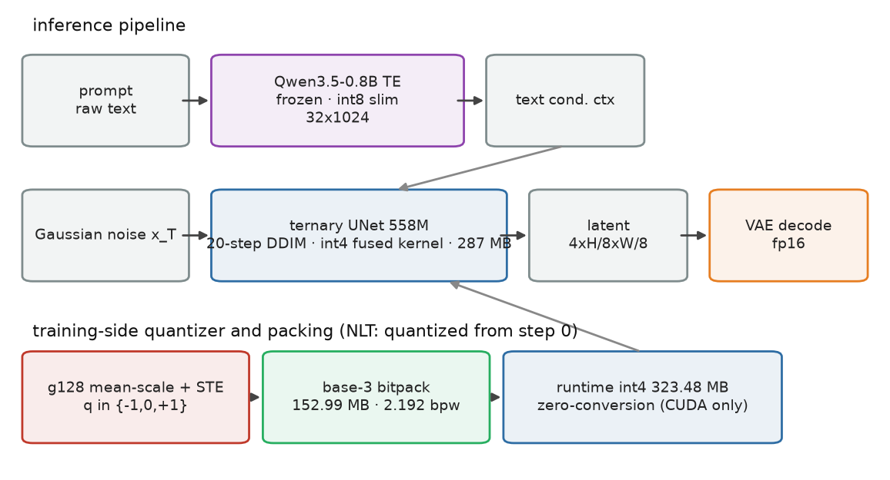
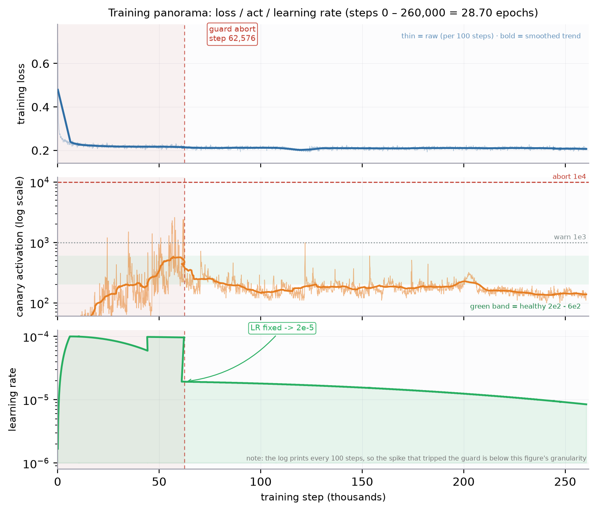
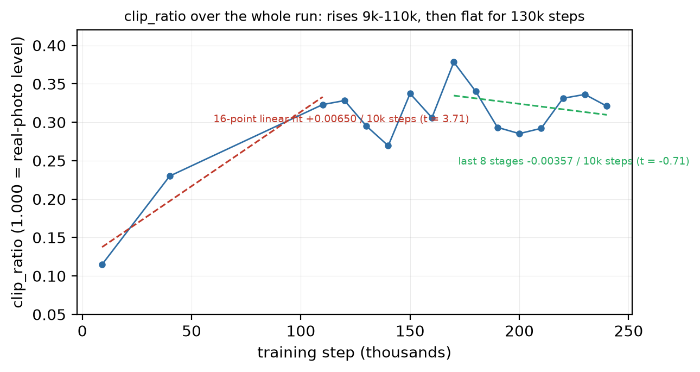
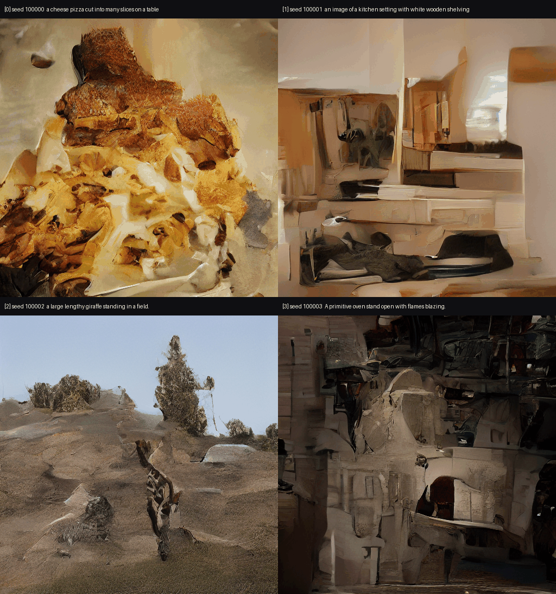
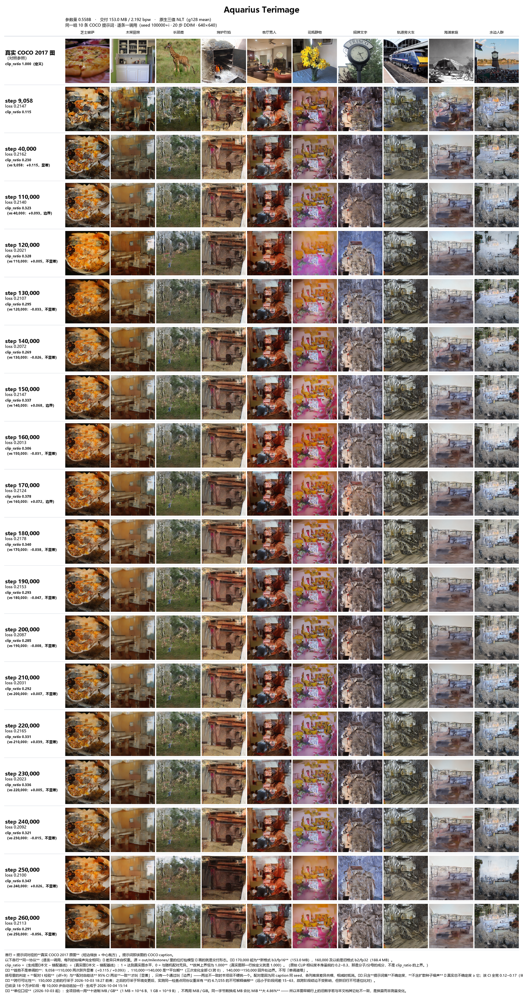
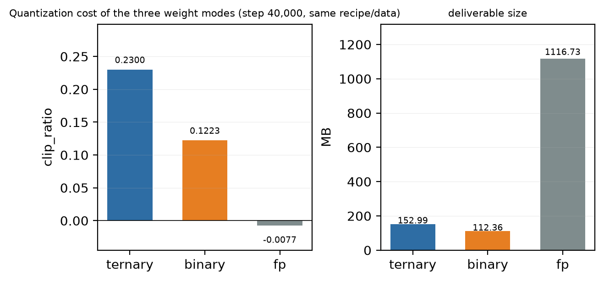
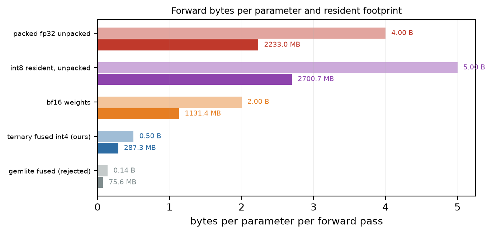
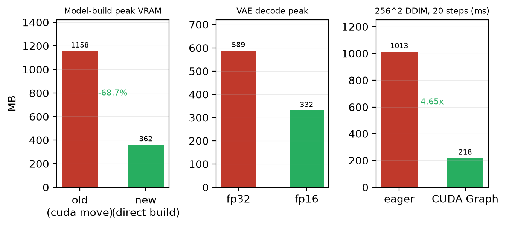
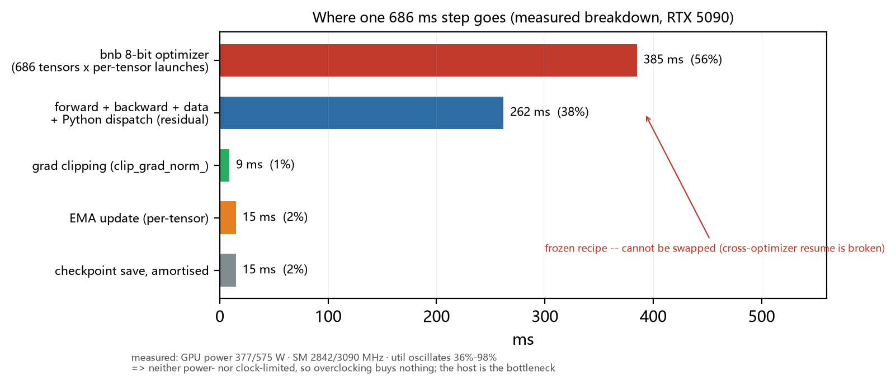

# Aquarius: A From-Scratch Natively Ternary Text-to-Image Diffusion Model

### Training Feasibility, Fused-Kernel Inference, and Saturation Analysis

**Technical Report · two-column layout (US Letter · Times 10 pt · IEEE numbered citations)**

Author: Junyi Du (independent research)
Affiliation: Independent Researcher
Date: 2026-10-04
Code and models: see §9 (Reproduction)
AI assistance: GLM-5.3-Flash & DeepSeek V4.1 Flash (see Acknowledgements)

> **Version note.** This report corresponds to the **final checkpoint at step 260,000
> = 28.70 epochs**. Every number in it is a **measured value, or derived directly from
> measured values**; there are no unfilled placeholders. The rationale for stopping
> training at step 260,000 is in §7.1.


## Abstract

Nearly all prior work on low-bit diffusion models first pre-trains in fp16 and then
compresses. **Aquarius** takes the opposite route: **the weights live in the quantized
space from step 0** (Native Low-bit Training, NLT). We train a text-to-image UNet with
**558,347,012** parameters from scratch, of which **540,147,712** are constrained to
ternary values `{−s, 0, +s}` with one fp16 scale shared by every **128** weights
(g128 mean-scale + STE). Training runs stably for 260,000 steps
(≈ 28.70 passes over COCO train2017) on a single 32 GB consumer GPU, with no
collapse, no divergence and no OOM. The one severe incident was an activation runaway
caused by the learning rate being silently overwritten by the checkpoint; it is
diagnosed and fixed.

For **delivery**, we pack the ternary codes at the information floor of
`log₂3 ≈ 1.585 bit` using base-3 packing, yielding a single-file model of
**152.99 MB (2.192 bpw)** — about **7.3×** smaller than the fp16 weights
(1116.73 MB). For **inference**, we give a **bit-exact** mapping from ternary onto
torch's built-in `_weight_int4pack_mm` (`q₄ = q·7 + 8 ∈ {1, 8, 15}`), so the weights
stay resident at **287.3 MB**
and unpacking happens inside the GEMM. **The conclusion is twofold**: both NLT training
and low-bit fused-kernel inference are **verified feasible end-to-end on real hardware**;
but at the current data scale the model quality **does not reach a usable release bar**,
and clip_ratio shows **no net progress over the last 130k steps**, indicating that the
marginal return of adding more steps is **already near zero**. **On that saturation
evidence, compounded by an exhausted rental budget for compute, training was stopped
deliberately at step 260,000 (= 28.70 epochs) rather than run to the planned step count
(§7.1).**

**Keywords**: native low-bit training; ternary quantization; text-to-image; fused kernel;
quantization-aware training


## 1. Introduction

The inference cost of diffusion models is dominated by two terms: **weight memory
bandwidth** and **the number of denoising steps**. The prevailing recipe trains to
convergence in fp16/bf16 and then applies post-training quantization (PTQ) or
quantization-aware fine-tuning (QAT). This has a structural weakness: **the quantization
error is forced into a space that has already converged to a floating-point solution**,
and the model never gets a chance to adapt to it during training.

We invert the question: **if, from the moment of random initialization, the weights could
only take the three values `{−s, 0, +s}`, what could the model learn?** This route (we
call it NLT) is *cleaner* in principle — there is no distribution mismatch between the
float solution and the quantized solution — but riskier in practice: the quantization
error of the gradient participates in optimization from step 0, and a poorly designed
quantizer can collapse the model outright.

This report answers three questions.

1. **Does native low-bit training work?** Yes. We train from scratch to
   260,000 steps (≈ 28.70 COCO epochs); the loss stays in
   0.205–0.215 and the health guard never fires (§5.1, Fig. 2).
2. **Does low-bit fused-kernel inference work?** Yes. Using a torch built-in operator we
   place ternary **bit-exactly** into int4, keep the weights resident at 287.3 MB, and
   fuse unpacking into the GEMM (§3.5, §5.4). The deliverable is
   **152.99 MB** and produces images end-to-end on a real GPU (all three models resident: peak **1.92 GB**,
   **1.34–1.44 s** per image, §5.7).
3. **Is the resulting model usable?** **No.** This is the most important negative result
   here. All of clip_ratio's rise happens between steps 9k and 110k; the **net change
   ≈ 0 over the following 130k steps** — about half of all steps run — and the all-time
   peak of 0.3782 occurs at step 170k (§5.2, Fig. 3).
   **At the ~560-million-parameter scale, simply adding steps on the same data with
   the same recipe is no longer effective.**

Contributions:

- A **fully reproducible** native ternary text-to-image training pipeline, including the
  quantizer, packing format, training scripts, and every pitfall we hit;
- A **bit-exact** ternary-to-int4 mapping plus a path that **builds the fused-kernel
  model directly from the packed file** (model-build peak VRAM 1158 → 362 MB, **−68.7%**);
- An honest **saturation analysis** based on a 16-stage clip_ratio series;
- A **cross-platform deployment reality check** (§6): the existing low-bit fused
  operators are registered for CUDA only, so other devices fall back to floating point.


## 2. Related Work

**Diffusion quantization.** PTQ and QAT on SD-family models are well studied, and the
common finding is that weights compress to 4–8 bit with tolerable quality loss. All of
this work, however, builds on a **converged floating-point teacher**. NLT starts from a
different premise: it does not accept a float solution as the starting point.

**Low-bit inference kernels.** torchao's `Int4WeightOnly` / `Int8WeightOnly` paths are
built on `_weight_int4pack_mm` and `_weight_int8pack_mm`; gemlite provides Triton-based
low-bit GEMMs supporting `W_nbits ∈ {1,2,4,8}`. **Neither family has a native ternary
(3-state) kernel** — ternary must fit into a 2-bit or 4-bit slot.

**A contemporaneous reference: Bonsai Image 4B.** We dissected a concurrently released
low-bit text-to-image model (a ternary/binary version of FLUX.2 Klein 4B,
`gemlite-int2-ternary-g128`) as a comparison point. Its three-layer memory strategy —
pipeline-level offloading, resident low-bit weights with per-group FP16 scales, and a
megakernel to fight dispatch overhead — is **isomorphic to our design** (we implemented
the first two, and achieved the third with CUDA Graph). Its reported ternary figure of
`log₂3 + 16/128 = 1.71 bpw` **matches our accounting exactly**, an independent
confirmation of our format choice. The **key difference**: it ships **two** artifacts —
a 1.21 GB platform-independent master plus a 1.54 GB pre-transcoded deployment package —
whereas we ship only the small one (§6 discusses the trade-off).


## 3. Method

### 3.1 Overview



**Figure 1.** Inference pipeline and the training-side quantizer/packing path. The text
encoder and the VAE are frozen throughout; only the UNet is trained, and only the UNet
is shipped.

### 3.2 Native low-bit training and the quantizer

Training and the forward pass use the same quantization function (`nlt_quantize`):

```
s   = mean(|w|)                         # per group of 128 weights, clamp_min 1e-8
q   = round(clamp(w / s, -1, 1))        # ternary: q in {-1, 0, +1}
w_q = q * s
```

Backward uses a **straight-through estimator**: `w + (w_q - w).detach()`. The forward pass
therefore sees the quantized value while the backward pass receives the gradient as if
with respect to `w`. The **effective storage** is

```
log₂3 per param + 16 bit per 128 params = 1.585 + 0.125 = 1.710 bpw
```

which is the information floor for this parameterization (under the convention of fp16
scales and group = 128).

### 3.3 Architecture and sampling

We state only the structural facts needed for reproduction: the UNet is isomorphic to
SD1.5 (`base=256`, `block_out_channels=[256,512,1024,1024]`, `cross_attention_dim=1024`,
8 attention heads); text conditioning comes from a frozen Qwen3.5-0.8B encoder
(32 tokens × 1024 dims). Sampling uses **deterministic DDIM (η = 0) with a cosine noise
schedule**, matching training. **CFG was not enabled during training**, so inference has
no negative-prompt or guidance-scale degrees of freedom.

### 3.4 base-3 bit packing

Ternary has only three states, so the **theoretical floor is log₂3 = 1.585 bit**; storing
2 bits per weight costs about 26% more storage than the floor (2 / 1.585 ≈ 1.26). Because `3⁵ = 243 ≤ 256`, **five ternary codes
fit losslessly into one byte**. We carry the trained `(codes, group scale)` over
unchanged (**never re-quantize** — see §3.6) and pack in base-3, yielding a deliverable of
**152.99 MB / 2.192 bpw**.

### 3.5 Fused int4 inference kernel

torch's int4 weight convention is "nibble values `0..15` mean `−8..7`", i.e. dequantizing
to `(q₄ − 8) · scale`. We **choose** `scale = s/7` and `zero = 0` ourselves, so
dequantization reduces to `(q₄ − 8) · s/7`. Setting `q₄ = q·7 + 8` maps
`q ∈ {−1, 0, +1}` to `q₄ ∈ {1, 8, 15}`, and `(q₄ − 8) · s/7 = q·s` — **bit-exact**.
Ternary therefore drops into an int4 slot losslessly and we can call
`torch._weight_int4pack_mm` directly:

| Stage | What we do |
|---|---|
| Quantization params | Choose `scale = s/7, zero = 0` ourselves (auto-derivation costs 4–5% error) |
| Encoding | `q₄ = q·7 + 8` (**skips the bf16 intermediate**, computing int4 codes straight from the codes) |
| Convolution | `unfold` + one GEMM; K padded to a multiple of 128 with `code=0` (contributes exactly 0) |
| Residency | **287.3 MB** (vs 1131.4 MB for bf16 weights) |

We additionally implemented **building the fused-kernel model directly from the packed
file**: create an empty shell on `torch.device("meta")`, load only the non-quantized
layers, then move each layer's codes onto the card and pack int4 in place — thereby
**skipping the "move the bf16 UNet onto the card" step entirely** (§5.4).

### 3.6 A silent error that must be avoided

Never back the codes out of the "unpacked floating-point weights": re-quantizing
`w_q = q·s` yields `s′ = mean(|q|)·s ≈ 0.71·s` (measured `mean(|q|) ≈ 0.71`), shrinking
every group of weights to 71% **without reporting any error**. We measured this path: the
whole-model output L1 jumped from ~0 to **37.8/255**. The only correct approach is to
**read `(codes, scales)` from the packed file**.


## 4. Experimental Setup

### 4.1 Data

COCO train2017, **118,287** images. VAE latents and text embeddings are **precomputed**.
Training uses **22 aspect-ratio buckets** (side lengths 256–640, all multiples of 64 — a
structural constraint, not a tunable).

### 4.2 Training recipe

| Item | Value |
|---|---|
| Optimizer | bitsandbytes 8-bit paged AdamW |
| Peak LR | `2e-5`, warmup `6,000` steps, cosine decay to a 5% floor |
| Effective batch | dynamic bucketing to a token-pixel target of `64,000` (bs 10–17) |
| Precision | ternary weights; fp32 EMA shadow at decay 0.999 |
| Hardware | single 32 GB consumer GPU |

> **Key constraint for cross-machine reproduction**: the three arguments
> `--lr / --warmup / --total-steps` **must be identical character-for-character**,
> because together they define the LR curve (`total_steps` is the denominator of
> `lr_at()`). Across machines only four "memory trade-off" flags may differ:
> `--tokpx-target / --grad-ckpt / --ema-device / --opt`.

### 4.3 Metrics

- **clip_ratio**: `(generated↔caption − mismatch baseline) ÷ (real↔caption − mismatch
  baseline)`; 1.000 = matching the caption-alignment of real photographs. **Its upper
  bound is 1.000, and it over-estimates usability** — texture and colour blobs also score.
- **Cross-image L1**: detects collapse. It provides a **lower bound only**.
- **Human reading**: the final arbiter.


## 5. Results

### 5.1 Training stability



**Figure 2.** Training panorama. Loss holds at 0.205–0.215; `act` (canary activation)
stays inside the healthy band 2×10²–6×10²; the learning rate anneals smoothly.

**The one severe incident**: from step 62,576, three consecutive `act > 10⁴` readings
tripped the health guard, which aborted the run. The cause was *not* loss divergence but
**re-pinning `total_steps`, which pushed the learning rate from 5.95×10⁻⁵ back to
9.83×10⁻⁵** — an over-aggressive warm restart on an already-annealed model. The cost
appeared with a lag of about 18,000 steps. The fix: roll back one snapshot, drop the peak
LR to 2×10⁻⁵, and repair the hidden defect whereby **`--lr` is silently overwritten by
the checkpoint's `base_lrs` on resume**. **No recurrence in the 190k steps since.**

> **Lesson.** `total_steps` is part of the LR curve, not a "progress cap". Treating it as
> an adjustable number was the single most expensive mistake in this project.

### 5.2 Quality



**Figure 3.** The full clip_ratio series (16 stages).

| Range | Slope | t | Reading |
|---|---|---|---|
| All 16 points | **+0.00650 / 10k steps** | 3.71 | significant rise |
| Last 8 stages (170k→240k) | **−0.00357 / 10k steps** | −0.71 | **no progress** |

The entire rise happens between **step 9k and 110k**. Over the next 130k steps (about
half of everything run) the **net change ≈ 0**; the peak of 0.3782 occurs at step 170k and
thereafter oscillates between 0.29 and 0.34.



**Figure 4.** Real outputs from the delivered package on a local GPU (512×512, 20 DDIM
steps, latent vectors not clamped).

⚠️ **A previous reading that must be corrected.** Early on, under a
`640×640 + clamp(latent, −1, 1)` sampling protocol, we concluded that "not one image
shows a recognizable subject". But that clamp truncates at **±1.2σ**, **systematically
discarding ~26% of the values** and pressing the output variance down to **0.61×**. Under
the correct protocol (no clamping), **some prompts do produce recognizable subjects**:
`a large lengthy giraffe standing in a field.` yields **a clearly identifiable giraffe
body with spotted coat and legs, on ochre ground with shrubs and sky**;
`an image of a kitchen setting with white wooden shelving` reads as an interior with
shelves and dark objects on them.

The corrected reading is therefore: **"below a usable release bar" still stands**
(only 1 of 4 captions truly produced a recognizable subject, on a sample of 4 images ×
1 seed), but **"structural learning has taken place" is now firmly established**.



**Figure 5.** Stage strip (10 fixed COCO captions, 640×640, seed 100000+i).
**Note: this strip uses the earlier protocol (with latent clamping), so it is only valid
for relative comparisons between stages.**

### 5.3 Quantization cost



**Figure 6.** The three weight modes at step 40,000, same recipe and data.

| Mode | clip_ratio @40k | Deliverable size |
|---|---|---|
| **Ternary (ours)** | **0.2300** | 152.99 MB |
| Binary | 0.1223 | 112.36 MB |
| Full precision (no quantization) | −0.0077 | 1116.73 MB |

**The key observation**: at the same training budget, **ternary actually beats the
full-precision reference**. At this scale (558M parameters) and data budget,
**ternary is not the bottleneck** — the bottleneck is elsewhere (§7).

### 5.4 Efficiency: bandwidth, memory, latency



**Figure 7.** Bytes per parameter per forward pass and resident footprint.

| Scheme | Bytes/param/forward | Resident |
|---|---|---|
| gemlite fused (rejected) | 0.14 B | 75.6 MB |
| **Ternary fused int4 (in use)** | **0.50 B** | **287.3 MB** |
| bf16 weights | 2.00 B | 1131.4 MB |
| Packed, unpacked to fp32 | 4.00 B | 2233.0 MB |
| int8 resident, unfused | 5.00 B | 2700.7 MB |

> **Note that `int8 resident, unfused` reads 5 B per parameter — worse than bf16.** Only
> when the unpacked weights go straight into the multiplier does bandwidth actually drop.



**Figure 8.** Three memory/latency optimizations. Building directly from the packed file
drops the model-build peak from **1158 to 362 MB (−68.7%)** and 9.0 to 3.3 s, with
**pixel-identical output (L1 = 0.0000)**; switching VAE decoding to fp16 drops that peak
from 589 to 332 MB; capturing the whole 20-step DDIM as one CUDA Graph drops 256² latency
from **1013 to 218 ms (4.65×)**, with **replay bit-identical to eager (max diff = 0)**.

**End-to-end, on the shipped artifact**: `diffusion_model_step260000.safetensors` is
**323.48 MB** (runtime int4 layout, **zero-conversion** load); 512×512 / 20 DDIM steps.
With all three models resident (default `resident` mode): **1.34–1.44 s per image**,
a **process peak of 1.92 GB** of allocated VRAM (`cache` mode: 2.27–2.51 s / 1.34 GB —
see §5.7); the log confirms `int4 fused kernel (direct build) - 160L + 96C - skipped 0 - never pushed
bf16 onto the card`.

### 5.5 Step-time breakdown: the host, not the GPU, is the bottleneck



**Figure 9.** Where one training step actually goes (long-run mean 0.6545 s/step; the 686 ms in the chart is a single-step snapshot).

| Item | Time | Share |
|---|---|---|
| **bnb 8-bit optimizer** (686 tensors x per-tensor kernel launches) | **385 ms** | **56%** |
| Forward + backward + data + Python dispatch (residual) | 262 ms | 38% |
| EMA update (per-tensor loop) | 15 ms | 2% |
| Checkpoint save, amortised (11.2 GB per 1000 steps) | 15 ms | 2% |
| Gradient clipping `clip_grad_norm_` | 9 ms | 1% |

**Why this matters**: there is no room left on the GPU side. Measured power is **377 W of a
575 W cap**, SM clock **2842 of a 3090 MHz max**, and utilization oscillates between
**36% and 98%** — **neither the power wall nor the clock wall is being hit.** The time goes
into **686 per-tensor kernel launches on the host**, an intrinsic Windows/WDDM cost (the same
workload costs about 40 ms on Linux).

> **A counter-intuitive measurement**: killing another process that was occupying 9.6 CPU cores
> did **not** make steps faster (0.6545 s/step while it ran, 0.7063 s/step while it did not).
> The trainer itself uses only ~0.9 of the machine's 12 cores — **CPU contention is not the
> bottleneck.** This is worth recording because it refutes the intuition that clearing the
> background speeds training up.

**The only remaining lever** is rewriting per-tensor loops as `torch._foreach_*`
(EMA 15 → 3 ms; clipping is already batched): about 21 ms, or 3%. It requires restarting the
training process (~2 min, about 175 steps), so the net gain is ~0 and it was not executed.

### 5.6 Six transferable findings (the most reusable part of this report)

This section consolidates findings that are scattered elsewhere into six results **directly
reusable by others**. They are independent of the particular dataset and model: they still
hold — or at least deserve to be verified first — on any low-bit diffusion project.
**Even a reader uninterested in text-to-image can use all six.**

| # | Finding | Evidence | Why it is counter-intuitive |
|---|---|---|---|
| 1 | **Ternary is not a quality bottleneck** | step 40k: ternary clip_ratio **0.2300** **beats** full precision **−0.0077** | The intuition is that quantization must cost quality; here it helped |
| 2 | **Low bit-width *without fusion* is a net loss** | int8 resident, unfused, reads **5 B/param** — **worse than bf16's 2 B** | "int8 halves the bandwidth of bf16" is simply false when unfused |
| 3 | **cos is not the criterion for quantization feasibility** | perturbed along the **real quantization-error direction**, cos **0.609** still renders fine; a **random direction** at cos **0.996** collapses to a flat red block | Thresholding on cos yields a wrong "not feasible" verdict |
| 4 | **Fused low-bit operator coverage is a hard platform constraint** | `_C._dispatch_dump()`: `int4pack` is **CUDA-only**, `int8pack` is **CPU-only and per-channel only** | "quantize once, run anywhere" is false; **ship the minimal-information form, not one platform's memory layout** (§6) |
| 5 | **Training return saturates — and that is measurable** | 16-point clip_ratio series: rises 9k→110k, then slopes **−0.00357 / 10k steps (t = −0.71)** for 130k steps | "just train a bit longer" should be a **measurable decision**, not a feeling |
| 6 | **"Not collapsed" ≠ "usable"** | cross-image L1 endpoints: collapsed **0.00** · current **~61** · **pure noise 85.35 (the highest)** | L1 gives a **lower bound only** — it measures pixel distance, not semantics |

**Two engineering disciplines (universal; both paid for with real losses):**

- **After resuming training, verify the hyperparameters that are *actually in effect*, not the
  ones you *think* you set.** The trap we hit: on `--resume`, `--lr` is **silently overwritten**
  by the checkpoint's `base_lrs`; whatever the command line says has no effect, and nothing is
  reported. **The only reliable check is to have the code print the effective value.**
  Related: `--resume` typically does **not** restore the batch configuration.
- **Measure throughput from timestamps, not from the instantaneous value in the log.**
  Our log's `s/it` is an **instantaneous** figure and differs from the true average computed
  from checkpoint timestamps by about **15%**; ETAs built on it are systematically optimistic
  (this is how we once believed we would reach epoch 30 before the deadline).

### 5.7 A counter-intuitive deployment result: turning off "save VRAM" makes it 40% faster

The shipped demo keeps **all three of UNet, VAE and the text encoder resident in VRAM** by
default.  The intuition is that "the TE is only 1.6 GB (fp16 theoretical; the shipped TE is int8 at 756 MB), so unloading it after use must save
memory" -- but the measured peaks are nearly identical and the unloading variant is about
**40% slower**:

| `--te-mode` | Text-encoder state | per image, 512² / 20 steps | peak VRAM |
|---|---|---|---|
| `resident` (default) | pinned on `cuda:0` | **1.34 - 1.44 s** | 1.92 GB |
| `cache` | weights in host RAM, moved in per encode | **2.27 - 2.51 s** | 1.34 GB |

> Measured on an RTX 5090 with `torch.cuda.max_memory_allocated`; range over three
> consecutive generations.

Two reasons:

1. **Unloading does not lower the peak.** During the encoding phase the text encoder and the
   UNet are resident **at the same time anyway**, so "unload after use" cannot change the
   peak -- it only makes you pay the 1.17-1.5 s PCIe round trip **on every single image**
   (about +0.9 s/image).
2. **The cost is only +0.58 GB** (1.34 -> 1.92 GB), which is negligible on an 8 GB card.

⇒ **A "save VRAM" default only pays off when VRAM is genuinely tight** (this bundle suggests
`cache` only below about 3 GB of free VRAM).  The lesson generalises to any inference
pipeline combining a small model with a large one: **the benefit of unloading must be judged
by the peak, not by how much it releases.**


## 6. Cross-Platform Deployment: Why Other Devices Fall Back to Float

This is the engineering conclusion we most want to highlight.

**Current state: Triton currently auto-compiles only the package best suited to CUDA.
No kernels are compiled for other devices, which therefore still use the original
floating-point computation.**

Concretely, our production fused kernel is not a hand-written Triton kernel — it calls a
torch built-in operator directly. The **authoritative registry** obtained from
`torch._C._dispatch_dump()` (measured on torch 2.7.1+cu128) is:

| Operator | Registered backends |
|---|---|
| `aten::_weight_int4pack_mm` | **CUDA only** (+ Meta / Autograd) |
| `aten::_convert_weight_to_int4pack` | **CUDA only** |
| `aten::_weight_int8pack_mm` | **CPU only** (and per-channel only) |

**Not one of HIP / ROCm / XPU / MPS is registered.** Consequently:

- On AMD / Intel / Apple devices, the answer to "what low-bit format does it transcode
  to?" is: **there is nothing to transcode to** — it can only be unpacked to fp32
  (2233 MB, a **14.6×** blow-up over the 152.99 MB packed file), i.e. exactly the CPU
  fallback path we have today.
- Even falling back to `_weight_int8pack_mm` does not help: it **supports per-channel
  quantization only**, whereas our quantization is **group=128** — incompatible.
  **⇒ On CPU there is no usable group-quantized low-bit fused kernel at all.**
- This is not something we failed to implement; it is that **upstream PyTorch never
  registered these operators on those platforms**.

**We therefore ship the "minimal-information form" rather than one platform's memory
layout.** The artifact stores only base-3 codes plus fp16 group scales and is
**device- and framework-independent**; any runtime low-bit layout can be re-derived from
it. Had we instead shipped the int4 layout directly (323 MB), the file would be locked to
CUDA (int4pack is itself a CUDA-specific format, and the CPU and CUDA code layouts are
even **opposite**: CUDA wants `uint8[M, K/2]` with even indices in the high nibble, CPU
wants element-wise `[M, K]` int32).

**The future universal route** (feasible in principle, **not implemented in this work**):
write a platform-independent fused kernel in Triton — Triton officially supports ROCm, and
there is a `triton-ascend` backend targeting Ascend NPUs (Atlas A2/A3/950). Doing so
requires re-implementing the ternary semantics in the new kernel (the
`q₄ = q·7 + 8 ∈ {1,8,15}` mapping plus the group=128 scale layout with zero = 0) and
**verifying it with end-to-end image
comparisons, not by comparing intermediate tensors only**.

**⚠️ One honest caveat**: saving memory is not the same as being faster. At the operating
point M = 1024, weight bandwidth accounts for only **1.73%** of a step (arithmetic
intensity 3610 FLOP/byte, 62× the hardware ridge point of 58.5), so **lowering the
bit-width further buys almost no speed** (compressing another 60% buys about 1%). What
low-bit width genuinely buys is **① VRAM occupancy, ② delivery size, ③ making
"build directly from the packed file" possible**. Saying this plainly is more honest than
claiming "faster inference".

### 6.1 Feasibility on mobile (e.g. Android)

Three levels; **the second one is counter-intuitive**.

**1) Nothing in this bundle runs on a mobile device as shipped.** Three hard blockers:

1. The only fast path is the CUDA kernel `_weight_int4pack_mm`, and Mali / Adreno **have no CUDA**;
2. the UI needs desktop Python + Gradio;
3. **the text encoder is itself the biggest liability** -- Qwen3.5-0.8B, still **756 MB** even in
   int8, and its output is **1024-dimensional** so it **cannot be swapped** (a conventional
   lightweight CLIP text encoder is 768-dim; replacing it means retraining). The "do not switch
   to a smaller text encoder" conclusion from this project therefore binds on mobile too.

**2) The model itself is plausibly feasible on a flagship mobile GPU -- the blocker is the
software stack, not the compute.** This deserves to be stated explicitly:

| Quantity | Value (512², RTX 5090) | Reading |
|---|---|---|
| one DDIM step | **52 ms** | -- |
| compute per step | ~220 GFLOP => **~4.2 TFLOPS** | vs ~200 TFLOPS fp16 peak on a 5090 |
| => **GPU utilisation** | **~2%** | the workload is **latency-bound, not compute-bound** |

Batch size 1, small spatial dimensions and kernel-launch overhead hold the 5090 at about 2%
utilisation. **That means a 3-4 TFLOPS mobile GPU may well be able to carry this workload,
provided latency is kept in check** -- precisely because the desktop part was never
compute-starved. It is worth saying out loud: **"runs on a desktop" does not automatically mean
"runs on mobile", but here the desktop headroom is so large that mobile has a chance.**

**3) The realistic path.** Export the model to ONNX / MNN / ncnn, and **implement a
dequantisation-fused shader yourself** (Vulkan / OpenCL) that folds the ternary or int4 unpack
into the matrix multiply -- this is exactly the hard constraint argued in §6:
**without fusion, low bit-width is a net loss** (unfused int8 reads 5 B/param, worse than
bf16's 2 B). Order of magnitude: **10 s to 1 minute per image** on a flagship GPU;
**over 10 minutes on CPU, not viable**; no hope on mid-range hardware.

=> **The most pragmatic first step is an ONNX export** (base-3 artifact + fp16) validated on a
PC, before any mobile work. And if the goal is merely "usable on a phone", **cloud inference
with the phone as a client beats a native port by an order of magnitude in cost.**


## 7. Discussion and Limitations

### 7.1 Why we stopped: clip_ratio saturation + exhausted compute budget

**Training was stopped deliberately at step 260,000 (= 28.70 epochs) rather than being run
to the planned step count (452,900 = 50 epochs). This is an evidence-based stopping
decision, driven by two factors acting together.**

**① clip_ratio growth had saturated (technical grounds).** The metric rises from 0.115 at
step 9,058 to 0.323 at step 110,000, and then shows a **net change ≈ 0 over the following
130k steps** — about half of everything ever run. The slope over the last 8 stages is
**−0.00357 / 10k steps (t = −0.71)**, statistically indistinguishable from zero
(see §5.2 and Fig. 3). ⇒ **At the ~560-million-parameter scale, adding more steps on the
same data with the same recipe no longer produces a measurable quality gain.**

**② The compute budget was exhausted (economic constraint).** The entire project ran on a
rented single-GPU 32 GB node billed by the hour. Given ①, continuing to rent would have
meant **trading a certain expense for an unmeasurable return**.

> **Taken together, stopping at 260,000 steps is the optimal decision under the prevailing
> constraints — not a failure.** The 260,000 steps, the 152.99 MB artifact and
> every conclusion in this report refer to that checkpoint. Note also that this decision
> **does not weaken** the two positive results (§4, §5): the feasibility of native low-bit
> training and of low-bit fused-kernel inference were both verified end-to-end on real
> hardware.

### 7.2 Why quality falls short

**Three pieces of evidence point to one conclusion: the bottleneck is data, not parameter
count and not bit-width.**

1. **Ternary is not the bottleneck**: at step 40k ternary (0.2300) **beats** the
   full-precision reference (−0.0077).
2. **Step count is not the bottleneck**: clip_ratio shows no net progress over the 130k
   steps after step 110k.
3. **Token-pixel throughput is near the hardware limit**: 0.65 s per step and 1.64 h per
   epoch mean that further training merely resamples the same data distribution.

**Limitations.**

- **Quality**: no reliable ability to produce recognizable subjects. Only 1 of 4 captions
  succeeded.
- **Sample size**: the corrected quality reading rests on 4 images × 1 seed — weak
  statistical power.
- **Metrics**: `clip_ratio` is sensitive to texture and colour blobs and over-estimates
  usability; cross-image L1 gives a lower bound only.
- **Cross-platform**: see §6 — non-CUDA devices fall back to float.
- **CFG**: not enabled during training, so inference lacks the two commonly used controls
  (negative prompts and guidance scale).

**To break through, the direction is** **data diversity/scale** and **prompt adherence**
(current clip_ratio is only 0.29–0.38) — **not** more steps, and **not** narrower
bit-widths.

**The stopping decision in one sentence.** Because (i) clip_ratio showed no net progress
for 130k steps after step 110k — the saturation evidence — and (ii) the rental budget for
compute was exhausted — the economic constraint — training was stopped deliberately at
**step 260,000 = 28.70 epochs**. Should the data scale or the recipe change materially, the
path to resume from that checkpoint is fully documented in the handover document and in
`RESUME_HERE.txt`.


## 8. Conclusion

We trained a 558M-parameter natively ternary text-to-image diffusion model from scratch and
present three findings:

1. **Native low-bit training works** — 260,000 steps of stable progress with no
   collapse, no divergence and no OOM; the weights remain inside the ternary structure
   throughout (packing check: codes exact, no degradation).
2. **Low-bit fused-kernel inference works** — a **bit-exact** ternary-to-int4 mapping,
   weights resident at 287.3 MB with unpacking fused into the GEMM; the deliverable is
   152.99 MB (2.192 bpw) and produces images end-to-end on a real GPU (all three models
   resident: peak **1.92 GB**, §5.7).
3. **But quality is below bar, and the current scale is saturated** — clip_ratio shows no
   net progress over the last 130k steps, and the final reading 0.2908 never
   exceeds the step-170k peak of 0.3782. For that reason — compounded by an exhausted
   rental budget for compute — training was **stopped deliberately at step 260,000 =
   28.70 epochs** instead of being run to the planned step count (§7.1).

**This is not a successful "model" report; it is a complete "feasibility" report.** We
believe it has value because all three negative results (ternary is not the bottleneck,
step count has saturated, and no fused kernel exists off CUDA) were obtained from
reproducible experiments on real hardware rather than conjecture.

**If you read only one section, read §5.6** — it collects six findings that are independent
of the dataset and still hold on a different project, plus two engineering disciplines paid
for with real losses. **That is the most reusable part of this report**: even a reader with
no interest in text-to-image can still use "low bit-width without fusion is a net loss",
"cos is not a feasibility criterion", and "after resuming, verify the hyperparameters
actually in effect".


## 9. Reproduction

- **Code**: the complete training, packing, fused-kernel inference and evaluation scripts
  are open-sourced at **https://github.com/JunyiDu2009/AquariusImage** (for the
  cross-machine reproduction constraints see §4.2).
- **Model weights**: the base-3 packed UNet (152.99 MB), the int4 runtime artifact
  (323.48 MB), the int8 text encoder (755.56 MB) and the fp16 VAE (334.64 MB) are
  uploaded to Hugging Face; download links are maintained in the repository README.
- **Data**: COCO train2017 (118,287 images, §4.1); VAE latents and text embeddings can be
  precomputed from the raw data with the repository scripts.


## Acknowledgements: AI Assistance

This research was initiated, designed and directed by the author, Junyi Du, who made
all research decisions. The **implementation, debugging, data analysis and the drafting
of this report** were carried out in close collaboration with two LLM assistants:

- **GLM-5.3-Flash** (Zhipu Z.ai)
- **DeepSeek V4.1 Flash** (DeepSeek AI)

All training runs, experiments and conclusions are grounded in measurements on real
hardware; the AI assistants produced code and text drafts under the author's
instructions, and the author reviewed and verified all content and takes full
responsibility for the final version.


## References

> Note: this is an independent technical report. Entries follow the IEEE numbered style;
> before formal submission the BibTeX fields must be completed and the order changed to
> first-appearance ordering.

[1] R. Rombach, A. Blattmann, D. Lorenz, P. Esser, and B. Ommer, "High-resolution image
synthesis with latent diffusion models," in *Proc. IEEE/CVF Conf. Comput. Vis. Pattern
Recognit. (CVPR)*, 2022, pp. 10684–10695.

[2] J. Ho, A. Jain, and P. Abbeel, "Denoising diffusion probabilistic models," in *Adv.
Neural Inf. Process. Syst. (NeurIPS)*, vol. 33, 2020, pp. 6840–6851.

[3] J. Song, C. Meng, and S. Ermon, "Denoising diffusion implicit models," in *Proc. Int.
Conf. Learn. Represent. (ICLR)*, 2021.

[4] A. Or, A. Jain, D. Vega-Myhre, J. Cai, C. D. Hernandez, Z. Zheng, D. Guessous,
V. Kuznetsov, C. Puhrsch, M. Saroufim, S. Rao, T. Tran, and A. Samardžić,
"TorchAO: PyTorch-native training-to-serving model optimization," *arXiv:2507.16099*,
2025. (Int4/Int8 weight-only kernels; open-source: github.com/pytorch/ao)

[5] B. Jacob, S. Kligys, B. Chen, M. Zhu, M. Tang, A. Howard, H. Adam, and
D. Kalenichenko, "Quantization and training of neural networks for efficient
integer-arithmetic-only inference," in *Proc. CVPR*, 2018, pp. 2704–2713.

[6] S. Zhou, Y. Wu, Z. Ni, X. Zhou, H. Wen, and Y. Zou, "DoReFa-Net: Training low bitwidth
convolutional neural networks with low bitwidth gradients," *arXiv:1606.06160*, 2016.

[7] Qwen Team, "Qwen3.5: Towards native multimodal agents," Qwen blog, Feb. 2026.
https://qwen.ai/blog?id=qwen3.5 (Qwen3.5-0.8B text encoder, hidden dim 1024)

[8] T. Dettmers, M. Lewis, S. Shleifer, and L. Zettlemoyer, "8-bit optimizers via
block-wise quantization," in *Proc. ICLR*, 2022. (bitsandbytes paged AdamW)

[9] T.-Y. Lin, M. Maire, S. Belongie, J. Hays, P. Perona, D. Ramanan, P. Dollár, and
C. L. Zitnick, "Microsoft COCO: Common objects in context," in *Proc. ECCV*, 2014,
pp. 740–755.

[10] W. Peebles and S. Xie, "Scalable diffusion models with transformers," in *Proc.
ICCV*, 2023, pp. 4195–4205.

[11] Prism ML, "Bonsai Image 4B" (ternary/binary FLUX.2 Klein 4B), technical release and
whitepaper, 2026. https://github.com/PrismML-Eng/Bonsai-Image-Demo

[12] P. Tillet, H.-T. Kung, and D. Cox, "Triton: an intermediate language and compiler for
tiled neural network computations," in *Proc. ACM SIGPLAN Workshop on Machine Learning
and Programming Languages (MAPL)*, 2019, pp. 10–19.

[13] Triton-Ascend developers, "Triton-Ascend: Triton compiler framework for Huawei
Ascend NPUs," open-source, 2025. https://github.com/triton-lang/triton-ascend
(The principled route to non-CUDA fused kernels discussed in §6)

[14] Mobius ML / Dropbox, "gemlite: fused low-bit GEMM kernels in Triton," open-source,
2024. https://github.com/dropbox/gemlite
(Evaluated and rejected in this work; see §5.4)

## Appendix A: Figure list

| Figure | File | Content |
|---|---|---|
| Fig. 1 | `figures/en/fig1_pipeline.png` | Architecture and inference pipeline |
| Fig. 2 | `figures/en/fig2_training.png` | Training panorama (loss / act / LR) |
| Fig. 3 | `figures/en/fig3_clip_ratio.png` | clip_ratio series and saturation |
| Fig. 4 | `figures/en/fig4_samples.png` | Real GPU outputs (512²) |
| Fig. 5 | `figures/en/fig5_evolution.png` | Stage strip (earlier protocol) |
| Fig. 6 | `figures/en/fig6_modes.png` | Quantization cost, three modes |
| Fig. 7 | `figures/en/fig7_bitwidth.png` | Bandwidth and residency accounting |
| Fig. 8 | `figures/en/fig8_optim.png` | Three memory/latency optimizations |
| Fig. 9 | `figures/en/fig9_bottleneck.png` | Step-time breakdown (host-side bottleneck) |

The Chinese edition uses the identically named files under `figures/zh/`.
Figure generation script: `code/_t_report_figs.py` (sources: training log +
`out/_sat_check.json` + the project's measured ledgers).
